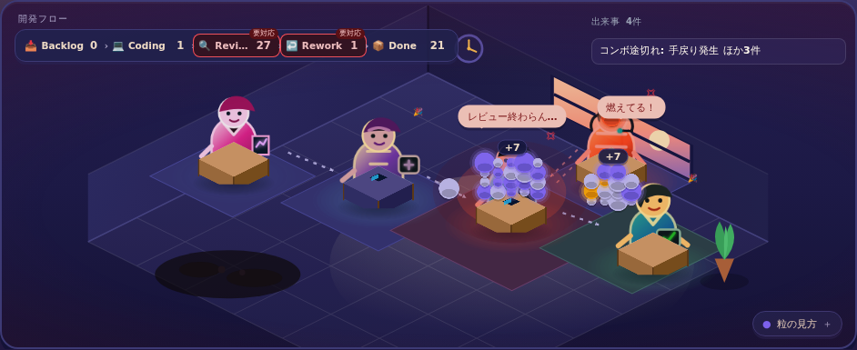

# DevOps Tycoon

> AIを入れたら最強になると思ったら、レビューが燃えた。

AI導入による開発速度の向上と、レビュー渋滞・手戻り・技術的負債・シニア過労のトレードオフを体験する、ブラウザ向け開発組織シミュレーションゲームです。



## ゲームについて

プレイヤーは開発組織のマネージャーとして、AIツール、テスト、ドキュメント、レビュー体制、採用などへ投資します。AIはCodingを加速しますが、組織能力が追いつかなければReviewやReworkへ負荷が移ります。

スプリント中は流れてくるタスクへリアルタイムに介入し、スプリント後はカード、組織進化、イベントを通じて次のボススプリントに備えます。目標未達でも組織が継続可能なら、目標と代償を選び直して次四半期へ進みます。

```text
編成
  ↓
スプリント ── リアルタイム介入、カード発動、レビュー渋滞と炎上
  ↓
リザルト ── 原因分析、無介入ベースライン比較、メンバー成長
  ↓
カードドラフト → 組織進化 → イベント
  ↓
四半期末ボス → 四半期レビュー → 勝利 / 目標修正 / 継続不能
```

## 主な機能

- タスクがBacklog、Coding、Review、Rework、Doneを流れるリアルタイム盤面
- 集中力を使う介入アクション、対象指定、コンボ、時限効果
- カードドラフト、手札、強化、レリック、組織進化ツリー
- メンバーの編成、AI配布、成長、疲労、採用
- 四半期目標、ボススプリント、目標修正、複数四半期ラン
- Review Hellなどの組織タイプ診断と「なぜ燃えたか」の振り返り
- 全社、部署、現場、業界ランキングを行き来するズーム階層
- 難易度、試練、実績、カード／レリックのメタ解放
- 同一seedで遊ぶデイリーランと端末内ランキング
- ラン途中セーブ、キーフレームリプレイ、BGM・効果音
- seed付き決定論による再現可能なシミュレーション

データはブラウザのIndexedDBへ保存されます。バックエンドや外部APIは使用しません。ブラウザのサイトデータを削除すると、メタ進行、ラン途中セーブ、リプレイも削除されます。

## プレイする

公開版は GitHub Pages で遊べます。

- [https://nimiusrd.github.io/devops-tycoon/](https://nimiusrd.github.io/devops-tycoon/)

初回のみ、リポジトリの Settings → Pages → Build and deployment → Source を **GitHub Actions** にしてください。以降は `main` への push で自動デプロイされます。

Pages 相当のビルドをローカルで確認する場合:

```bash
PAGES_BASE=/devops-tycoon/ npm run build
PAGES_BASE=/devops-tycoon/ npm run preview
```

## クイックスタート

### 必要環境

- Node.js 24以上
- npm
- WebGL対応ブラウザ（利用できない場合はDOM/SVGへ自動フォールバック）

`.nvmrc`を利用する場合:

```bash
nvm use
npm ci
npm run dev
```

ブラウザで [http://localhost:5174](http://localhost:5174) を開きます。

### URLオプション

| パラメータ | 例 | 用途 |
| --- | --- | --- |
| `seed` | `?seed=my-run` | 同じランを再現する |
| `renderer` | `?renderer=dom` | PixiJSではなくDOM/SVGレンダラを使う |
| `tutorial` | `?tutorial=force` | 初回ガイドを再表示する |
| `tutorial` | `?tutorial=off` | 初回ガイドを表示しない |

例:

```text
http://localhost:5174/?seed=review-hell&renderer=dom&tutorial=force
```

## Codexで開発する

Dockerを使うCodexタスクでは、リポジトリをCodexで開く前に
[`.codex/README.md`](.codex/README.md) の手順を完了してください。ユーザー設定へ
Dockerプロファイルを統合し、プロジェクトを信頼してからCodexを再起動すると、
このプロジェクトだけでDocker権限が有効になります。

## 開発コマンド

| コマンド | 内容 |
| --- | --- |
| `npm run dev` | 開発サーバをポート5174で起動 |
| `npm run build` | TypeScript検査と本番ビルド |
| `npm test` | Vitestのユニットテストを実行 |
| `npm run test:watch` | Vitestをwatchモードで実行 |
| `npm run test:mutation` | Strykerで`src/sim` / `src/state`のミューテーションテストを実行（incremental・ローカル用・CI非必須） |
| `npm run test:mutation:force` | incrementalキャッシュを無視して対象変異を再実行する |
| `npm run test:e2e` | Playwrightの標準E2Eを実行 |
| `npm run test:e2e:pixi` | PixiJSの視覚回帰テストを実行 |
| `npm run gallery` | 主要画面を撮影して`gallery/index.html`を生成 |
| `npm run playtest` | 全難易度×方針でランを自動プレイし結果を`playtest-out/`へ出力 |
| `npm run playtest:report` | プレイテスト結果をSPEC第19.1の判定基準ごとに集計 |
| `npm run balance:report` | 変更前後のplaytest JSONを同一seedで比較しJSON/Markdownレポートを生成 |
| `npm run lint` | ESLintを実行 |
| `npm run format:check` | Prettier差分を確認 |
| `npm run format` | Prettierで整形 |
| `npm run audio:generate` | BGM・効果音アセットを再生成 |

`test:mutation` は incremental モードです。結果は `reports/stryker-incremental.json` に保存され、次回は変更分だけ再実行します。ファイル単位で強制再計測する例: `npm run test:mutation:force -- --mutate src/sim/rng.ts`。HTML レポートは `reports/mutation/index.html` です。

GitHub Actions では [Mutation](.github/workflows/mutation.yml) ワークフローを **手動（workflow_dispatch）または週次スケジュール** で実行できます。PR / push の必須 CI には含めていません。既定は [`scripts/mutation-shards.mjs`](scripts/mutation-shards.mjs) のシャード並列です。

多数seedのバランス比較は [Balance report](.github/workflows/balance-report.yml) を手動または毎週月曜00:00 UTCに実行できます。既定では`main`の親commitと現在のcommitを同一コホートで測定し、ルールセット・設定値・勝率・Delivery／Incident／Reworkの分布差分を30日保持のartifactへ保存します。ローカルで保存済み出力を比較する場合は次の形式です。

反実仮想評価を手動で有効にする場合は、実行時間を制限するため`diffs`・`policies`・`seeds`を明示し、組み合わせを32ラン以下にしてください。

```bash
npm run balance:report -- \
  --before /tmp/before/runs.json \
  --after /tmp/after/runs.json \
  --before-root /tmp/before \
  --after-root /tmp/after \
  --out-dir /tmp/balance-report
```

コア全体は約 6,700 mutant・単一ジョブだと数時間かかるため、既定はディレクトリ単位の **並列シャード** で実行します。手動実行で `mutate` を指定すると、そのパターンだけを単一ジョブで回せます。`force` で incremental キャッシュを無視できます。レポートはシャードごとの artifact、incremental JSON はシャード単位の Actions cache に残ります。

壁時計の目安（初回・incremental なし）: シャードあたりおおむね数十分〜2時間。単一ジョブでコア全体を回すと推定 3〜6 時間で、180 分タイムアウトに達し得ます。

PlaywrightのChromiumが未導入の場合は、先に次を実行します。

```bash
npx playwright install chromium
```

Chromiumの実行ファイルを明示する環境では、`PLAYWRIGHT_CHROMIUM`または`GALLERY_CHROMIUM`を指定できます。

E2Eのポートが使用中の場合は、ホストとポートを上書きできます。

```bash
PLAYWRIGHT_HOST=127.0.0.1 PLAYWRIGHT_PORT=5175 npm run test:e2e
```

## 技術構成

| 領域 | 技術 |
| --- | --- |
| UI | React 19 / Framer Motion |
| 盤面・カメラ | PixiJS / pixi-viewport |
| 言語・ビルド | TypeScript / Vite |
| 状態・シミュレーション | 純TypeScriptの`RunEngine` / XState遷移契約 |
| 永続化 | IndexedDB / idb |
| 重い試算 | Web Worker / Comlink |
| グラフ | Recharts |
| テスト | Vitest / Playwright / Stryker（コアロジックのミューテーション・ローカル） |

`RunEngine`をラン状態の正本とし、Reactとレンダラはスナップショットを読んで表示します。シミュレーションは描画と永続化から分離し、同じseedと入力で同じ結果を返します。

## ディレクトリ

```text
src/
├── sim/       # 確率モデル、ラン進行、メンバー、組織集約
├── data/      # カード、レリック、イベント、難易度などの定義
├── state/     # メタ進行、セーブ、リプレイ、IndexedDB
├── render/    # 描画計画とPixiJS / DOMアダプタ
├── ui/        # React画面と操作UI
├── audio/     # BGM・効果音の再生
└── game.ts    # UI・E2E向けの操作ファサード

tests/
├── unit/      # ロジック、不変条件、統計レンジ
├── e2e/       # ブラウザ操作と視覚回帰
└── playtest/  # バランス計測用オートプレイ（npm run playtest。npm test の対象外）
```

## ドキュメント

- [SPEC.md](SPEC.md) — 体験要件と受入条件
- [plan/spec-mapping.md](plan/spec-mapping.md) — SPECと実装の対応
- [plan/remaining-issues.md](plan/remaining-issues.md) — 現在の未充足・保留課題
- [plan/mutation-remediation.md](plan/mutation-remediation.md) — ミューテーション結果に基づくテスト強化指示（現行ベースラインの RI。再計測時は新 ID）
- [docs/architecture.md](docs/architecture.md) — 技術構成と横断規律
- [docs/design-system.md](docs/design-system.md) — UIデザインの正本、トークン・レスポンシブ・アクセシビリティ・視覚検証の制約
- [docs/probability-model.md](docs/probability-model.md) — 確率モデル、seed設計、数式、検証方法
- [plan/README.md](plan/README.md) — 計画文書の索引

## 現在の開発状況

コアループは通しプレイ可能です。F-9 敗因別手触りの定性検証（RI-139）まで完了しています。
視覚表現拡張は RI-140〜143 で追跡し、Review の流れ・滞留・熱（RI-141）と炎上・鎮火・介入リアクション（RI-142）の WebGL 可視化まで完了しています。検証結果は[プレイテスト所見](plan/playtest-findings.md)、
未着手・完了項目は[残課題バックログ](plan/remaining-issues.md)を参照してください。

## ライセンス

ソースコード、生成スクリプト、ドキュメントなどは[MIT License](LICENSE)で公開しています。

`public/assets/`内の指定画像と生成済み音声は
[Creative Commons Attribution 4.0 International（CC BY 4.0）](https://creativecommons.org/licenses/by/4.0/)
で公開しています。対象ファイル、制作方法、必要なクレジットは
[ASSETS.md](ASSETS.md)を参照してください。
