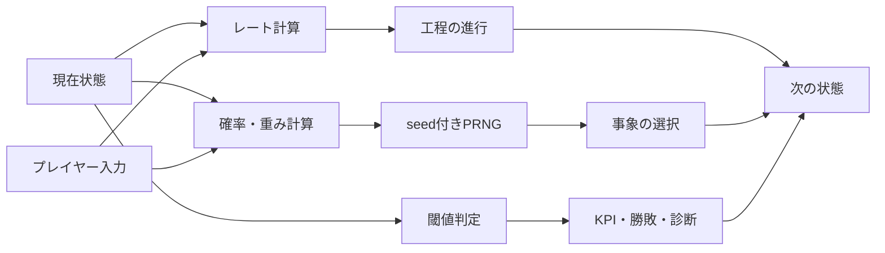
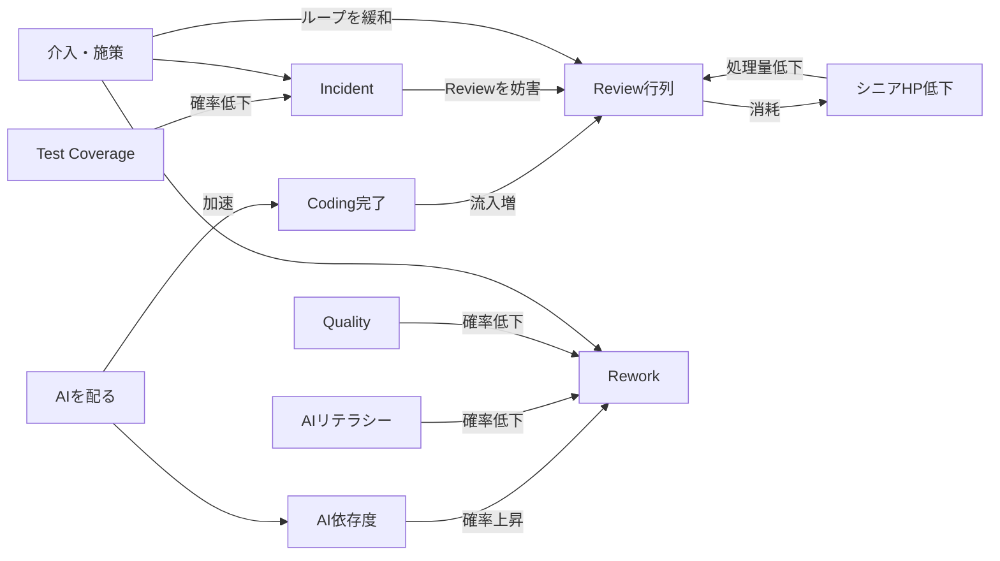
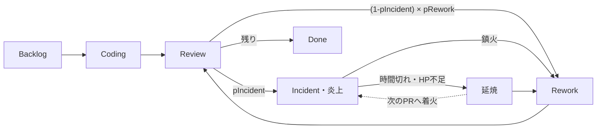
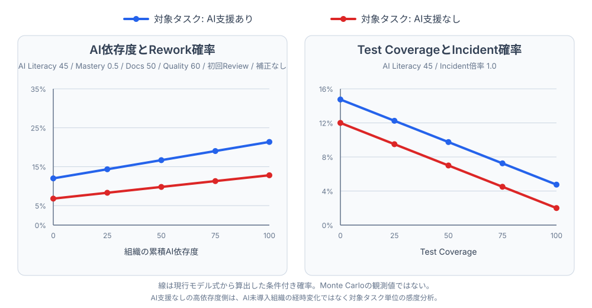
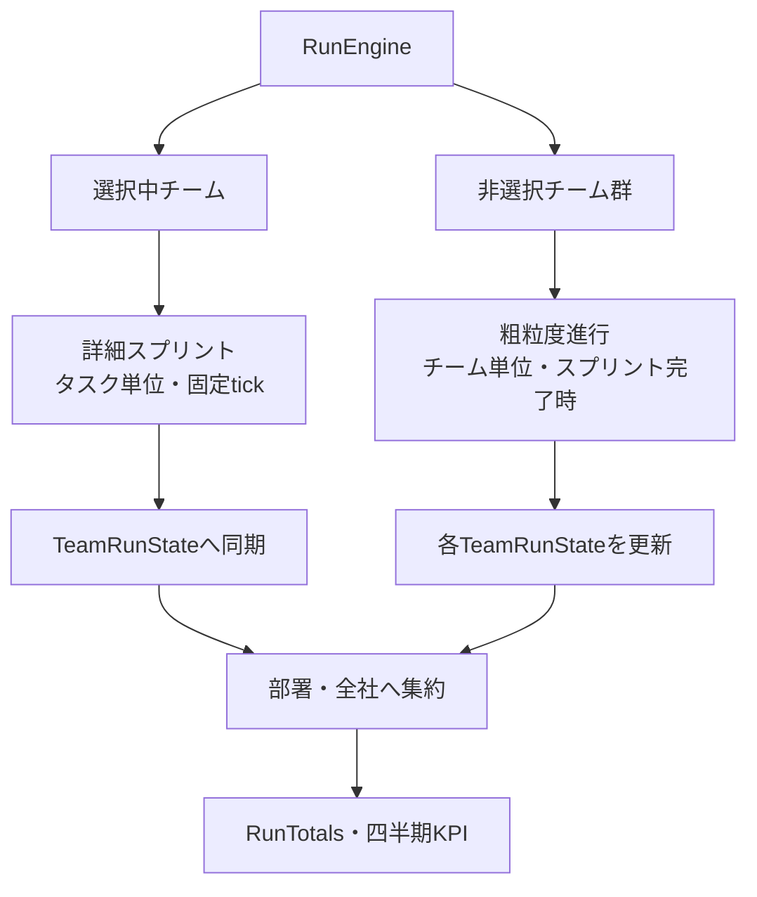

# 確率モデル

DevOps Tycoonの確率モデルについて、現行実装の構造、数式、seed設計、検証方法をまとめる。
体験要件は[`SPEC.md`](../SPEC.md)、個々の係数とデータは`src/sim/`と`src/data/`の実装を正とする。
係数のSSoTは型付きレジストリ、生成パラメータ表、代表確率曲線まで導入済みで、工程モデルは同じ定義と計算関数を参照する。SSoT移行（RI-104）とAI依存モデルの再設計・係数確定（RI-134）は完了済みである。

## 1. モデルの位置づけ

本作のモデルは、実データから学習した予測モデルではない。開発組織の因果関係をゲームとして体験できるよう、手調整した確率式、処理レート、重み付き抽選、決定論的な閾値判定を組み合わせたシミュレーションである。

中心に置く因果は次のとおり。

- AI利用はCodingを速める。
- CodingがReview能力を上回ると行列が伸びる。
- 現行実装では、品質や負債の共有リスクに加え、ワークフローが未熟なまま AI 前提度が上がるとReworkが増える。成熟したワークフローでは AI 支援ありが安全になりうる。
- テストカバレッジが低いとIncidentが増える。
- ReviewとIncident対応はシニアを消耗させ、Review能力をさらに下げる。
- カード、レリック、編成、難易度、試練、組織施策は、これらの率やレートを補正する。

処理の概念図は次のとおり。



中核となるフィードバックループは次のように読める。



「確率的であること」と「再現可能であること」は両立する。同じseed、同じ開始状態、同じ入力列なら同じ乱数列を消費し、同じ結果になる。異なるseedを多数試すことで、モデルが持つ結果分布を観測する。

## 2. 実装の正本

| 領域 | 主な正本 |
| --- | --- |
| PRNGとseed変換 | [`src/sim/rng.ts`](../src/sim/rng.ts) |
| 詳細スプリントの確率・レート | [`src/sim/model/process.ts`](../src/sim/model/process.ts) |
| 詳細スプリントの状態遷移 | [`src/sim/sprint.ts`](../src/sim/sprint.ts) |
| 編成による補正 | [`src/sim/member/roster.ts`](../src/sim/member/roster.ts) |
| カード効果とドラフト | [`src/sim/cards.ts`](../src/sim/cards.ts)、[`src/data/cards.ts`](../src/data/cards.ts) |
| 状態依存イベント | [`src/sim/run/events.ts`](../src/sim/run/events.ts)、[`src/data/events.ts`](../src/data/events.ts) |
| ラン進行と派生seed | [`src/sim/run/engine.ts`](../src/sim/run/engine.ts) |
| 独立チームと粗粒度進行 | [`src/sim/orgscale/teamState.ts`](../src/sim/orgscale/teamState.ts) |
| what-if試算 | [`src/sim/run/whatIf.ts`](../src/sim/run/whatIf.ts) |
| KPI、勝敗、診断 | [`src/sim/run/quarterReview.ts`](../src/sim/run/quarterReview.ts)、[`src/sim/outcome.ts`](../src/sim/outcome.ts)、[`src/sim/diagnosis.ts`](../src/sim/diagnosis.ts) |

## 3. PRNGと決定論

### 3.1 PRNG

文字列seedをFNV-1aで32bit整数に変換し、`mulberry32`で`[0, 1)`の擬似乱数列を生成する。シミュレーション層は`Math.random()`を使わず、`Rng`を引数で受け取るか、用途別の派生seedから`createRng`を生成する。

UI演出の位置ずらしなど、ゲーム結果へ影響しない乱数はこの契約の対象外である。

### 3.2 派生seed

一つの乱数列へすべてを接続せず、用途ごとに安定した文字列キーを作る。代表例は次のとおり。

| 用途 | 派生seedの形 |
| --- | --- |
| 初期ロスター | `{seed}:roster` |
| 四半期ボス | `{seed}:boss:q{quarter}` |
| スプリント | スプリントIDを含む専用seed |
| 手札 | `{seed}:deal:{sprintId}` |
| 成長・休職 | `{seed}:growth:{sprintId}` |
| ドラフト | `{seed}:draft:{sprintsPlayed}` |
| ビート | `{seed}:beat:q{quarter}:s{index}` |
| ショップ | `{seed}:shop:q{quarter}:s{index}` |
| チーム初期化 | `{seed}:team:{deptId}:{teamIndex}` |
| 粗粒度進行 | `{seed}:coarse:{stepKey}:{teamId}` |
| what-if | `{baseSeed}:what-if:{trialIndex}` |

これにより、例えばドラフト画面を開くタイミングが変わってもスプリント中の乱数列を消費しない。一方、同一ストリーム内で乱数を消費する順序は結果の一部である。既存ストリームへ判定を追加・並べ替えすると固定seedの結果が変わるため、意図しない場合は新しい派生seedへ分離する。

## 4. 詳細スプリント

選択中チームは、タスク単位の固定タイムステップでシミュレーションする。1 tickはシミュレーション上の離散時間であり、描画フレームレートから独立している。

以下で`clamp(x, a, b)`は、`x`を`a`以上`b`以下へ収める操作を表す。



### 4.1 タスク生成

スプリント開始時に各タスクを独立に生成する。

| 項目 | 分布 |
| --- | --- |
| `routine` | 30% |
| `normal` | 45% |
| `complex` | 25% |
| 高価値タスク | 12% |

高価値判定はタスク種別と独立で、高価値タスクの出荷ポイントは通常の3倍になる。

Done 時の出荷ポイントは、タスク種別の基礎点（高価値なら3倍）にコンボ倍率と AI 出荷価値倍率を掛ける。

```text
出荷ポイント =
  round(タスク基礎点 × コンボ倍率 × AI出荷価値倍率)

AI出荷価値倍率 =
  AI支援なしなら 1
  AI支援ありなら 1 + 0.85 × aiLiteracy / 100
```

AI 出荷価値倍率は Review 渋滞・Rework 増のコア因果とは独立に、部分配布でも純出荷が正側へ届く余地を残す（RI-77）。代表値（`aiLiteracy=45`）では AI 支援タスクが約 `1.38` 倍、`aiLiteracy=100` では `1.85` 倍になる。粗粒度チーム進行でも、推定 AI 採用率に同じ係数を掛けて選択中チームとの乖離を抑える。

### 4.2 AI利用とCoding

AIを使う確率は次のとおり。

```text
AI利用確率 = 0.85 × AIを配った稼働コーダーの割合
```

AI未導入なら常に0となる。AIを配ったコーダーがいなければ、組織全体のAI依存度が高くてもAI利用タスクは発生しない。

標準規模のCoding所要時間は7 tickで、タスク規模、AI利用、カード、編成で変わる。

```text
Coding所要tick =
  7 × タスク規模倍率
  ÷ AI速度倍率
  ÷ Coding速度補正
  ÷ routine補正
  ÷ 残業Coding倍率
```

- タスク規模倍率: `routine=0.7`、`normal=1`、`complex=1.7`
- AI速度倍率: AI利用時`2.6`、非利用時`1`
- 残業Coding倍率: 残業号令の有効中は`1.4`、通常時は`1`
- AI利用タスク1件につきAI依存度が`2.2`増える（Nightmare は難易度上書きで`0.8`。RI-74）

Coding自体の進捗は確率ではなくレート計算である。

### 4.3 Review能力

Reviewの1 tickあたり処理量は次のとおり。

```text
Review/tick =
  0.9
  × (0.3 + 0.7 × seniorHp / 100)
  × Review効率補正
  × Review容量補正
  × 残業Review倍率
  × 炎上中補正
```

シニアHPが下がるほどReviewが遅くなるが、HP 0でも基礎の30%は残る。残業Review倍率は残業号令の有効中が`1.6`、通常時が`1`である。炎上中補正は炎上中が`0.65`、通常時が`1`となる。Review 1件につきシニアHPを`1.6`消費し、炎上中はHP自然回復も`0.5`倍になる。

### 4.4 Incident

Review時、最初にIncidentを判定する。

```text
pIncident =
  clamp(
    (
      0.02
      + 0.10 × (1 - testCoverage / 100)
      + AI利用時 0.05 × (1 - aiLiteracy / 100)
    )
    × Incident倍率,
    0.01,
    0.40
  )
```

テストカバレッジが低いほど増え、AI利用タスクではAIリテラシー不足が追加リスクになる。カード、レリック、編成、難易度、試練は`Incident倍率`へ合流する。

Incidentになったタスクは即時に結果確定せず、35 tickの炎上状態へ入る。時間内にプレイヤーが鎮火しなければ、シニアHPが十分な場合は自動鎮火、足りない場合は延焼となる。この後半は閾値とタイマーによる決定論である。

ただし、炎上タイマーが切れる前にスプリントが`maxTicks`へ達した場合は終了時の畳み込みが優先される。残っている炎上タスクはシニアHPにかかわらず自動鎮火として記録され、HP消費も延焼も発生しない。終盤のIncident率、HP消費、延焼分布を分析するときは、この終了時例外を通常のタイマー解決と分けて扱う。

### 4.5 Rework

Incidentにならなかったタスクに対して、Reworkを判定する。

```text
W = clamp(0.40 × L + 0.40 × A_member + 0.20 × G, 0, 1)

sharedRisk =
  0.02
  + 0.12 × (1 - Q)
  + 0.08 × T

workflowRisk =
  U × (
      0.12 × (1 - W)
      + 0.24 × D × (1 - W)
    )

mismatchRisk =
  (1 - U) × (0.08 × D)

pRaw =
  sharedRisk
  + workflowRisk
  + mismatchRisk
  + Rework加算補正
  - PR分割時 0.16

pRework =
  clamp(pRaw × 0.5 ^ reworkAttempts, 0.02, 0.75)
```

RI-134ではAI成熟差を明瞭にする方針で係数を確定した。品質60・負債0・AI前提度100では、高成熟時のAI支援ありがAIなしより8ポイント安全になり、低成熟時のAI支援ありがAIなしより28ポイント危険になる。64個の固定seedによる統制スプリントで、成熟度・AI前提度・AI利用の効果量を回帰テストへ固定している。

| 変数 | 意味 |
| --- | --- |
| `U` | 対象タスクがAI支援ありなら`1`、なしなら`0` |
| `D` | チームのAI前提度（`org.aiDependency / 100`） |
| `L` | 組織のAIリテラシー |
| `A_member` | AIを配った稼働コーダーの平均AI習熟（正規化。シニア倍率で1を超えうる。最終的な`W`だけを0..1へclampする） |
| `G` | ドキュメント充実度 |
| `Q` | 品質 |
| `T` | `clamp(techDebt / TECH_DEBT_CAP, 0, 1)` |
| `W` | ワークフロー成熟度。既存値から都度導出し、新ゲージは持たない |

AI支援タスクをCodingへ取り込んだときだけ、組織のAI前提度が`2.2`増える。対象タスクがAI支援なしの場合、そのタスクによって前提度が増えることはない。AIなし実装による自動回復は入れない。低下はガイドラインや部門／チームの AI レバーに任せる。AI スロットルは新規の AI 支援タスクによる上昇を止めるだけで、既に上がった前提度は下げない。

したがって後述の赤線は「AI未導入組織でAI依存度が増えていく経時変化」ではない。過去のAI利用によって依存度が蓄積した組織で、対象タスクだけがAIを使わなかった場合の感度分析である。AIスロットル中や、AIが確率的に割り当てられなかったタスクが該当する。

`reworkAttempts`は通常Reworkだけでなく、Incidentで点火した場合にも1増える。そのため、どちらかを経験するたびにクランプ前の`pRaw`へ掛ける減衰係数が半分になる。ただし、`pRework`は最後に下限2%へクランプされるため、すでに下限へ達している場合の実確率は半減しない。

`MAX_REWORK=3`は通常Rework判定だけの上限である。`reworkAttempts >= MAX_REWORK`では通常Rework判定自体をスキップするため、その無条件確率は下限2%ではなく0となる。一方、Incident判定は通常Reworkより先に毎回行われ、`reworkAttempts`が3以上でも発生しうる。したがって「タスクのIncidentとReworkが合計3回で必ず収束する」という保証ではない。

`pRework`はIncidentが起きなかった場合の条件付き確率なので、Review1回あたりの無条件Rework確率は次の区分で表せる。

```text
P(Rework) =
  (1 - pIncident) × pRework  （reworkAttempts < MAX_REWORK）
  0                              （reworkAttempts >= MAX_REWORK）
```

代表的な初期条件で変数を一つずつ動かすと、確率は次のように変化する。



グラフは式から直接算出した条件付き確率で、Monte Carloの観測値ではない。読み取り値は次のとおり。
SVGは `npm run balance:docs` が現行のレジストリ値と `reworkProbability` / `incidentProbability` から生成する。候補式の曲線は含めない。

<!-- balance-curve-endpoints:begin -->
| 入力 | 対象タスク: AI支援あり | 対象タスク: AI支援なし |
| --- | ---: | ---: |
| AI依存度 0 → 100でのRework確率 | 13.04% → 25.52% | 6.8% → 14.8% |
| Test Coverage 0 → 100でのIncident確率 | 14.75% → 4.75% | 12.0% → 2.0% |
<!-- balance-curve-endpoints:end -->

#### 4.5.1 AI前提度とワークフロー成熟度

`aiDependency`は工程がどれだけ AI 利用を前提にしているかを表す。プレイヤーの勝負は、手作業能力を維持することではなく、AI 前提のワークフローを組織へ組み込むことである。`manualCapability`は採用しない。

| 概念 | 影響先 | 表現 |
| --- | --- | --- |
| 工程全体の共有リスク | AI支援の有無にかかわらず全タスク | `quality`、`techDebt` |
| AI前提ワークフローの成熟度 | 主にAI支援ありのタスク | `W`（`aiLiteracy`、平均`aiMastery`、`documentation`から導出） |
| AI前提度 | 未熟なAIありと、AIなしの工程ずれ | `aiDependency` |
| AIなしの工程ずれ | AI支援なしのタスク | `mismatchRisk` |

`W`の重みは合計1に固定する。個人単位の新状態やタスク担当者は対象外である。

#### 4.5.2 役割分担

- `sharedRisk`: 品質と技術的負債から受ける共通リスク
- `workflowRisk`: ワークフローが未熟なまま AI を使う検証不足。成熟すれば下がる
- `mismatchRisk`: 工程が AI 前提になったあと、AI を使わないずれ。AI なしは常に悪いわけではない

低`W`では AI ありが危険、高`W`では高前提度でも AI ありが安全になりうる。交差点は固定目標にしない。

旧`manualCapability`案の形状確認用曲線は[`proposed-ai-dependency-curves.svg`](../plan/assets/proposed-ai-dependency-curves.svg)に残すが、現行ゲームの挙動ではない。SSoTが照合するのは[`balance-curves.svg`](./generated/balance-curves.svg)だけである。

`A_member`は`W`へ入れ、編成集約の`reworkRateAdd`には載せない。トレイト由来の手戻りだけを編成補正へ残す。

#### 4.5.3 状態の更新

AI前提度は AI 支援タスクの取り込みで増え、ガイドラインや部門／チームの AI レバーで下がる。AI スロットルは新規の AI 支援タスクによる上昇を止めるだけで、既に上がった前提度は下げない。AI なし実装による自動回復や、手作業能力の減衰・回復は入れない。

#### 4.5.4 検証する不変条件

- 品質が高いほど、AI支援の有無によらずRework確率が下がる。
- 技術的負債が高いほど、AI支援の有無によらずRework確率が上がる。
- ワークフロー成熟度はAI支援ありのリスクだけを下げる。
- AI前提度が高いほど、未熟なAIありとAIなしの工程ずれは上がりうる。
- 高成熟ではAI支援ありが安全になり、低成熟ではAI支援ありが危険になる構成が存在する。
- `reworkAttempts`による減衰、下限、上限は現行どおり機能する。
- Incident率は別式で検証し、`testCoverage`をReworkとIncidentへ無意識に二重計上しない。

RI-134の係数確定では式や永続状態を増やさず、ルールセットv4として代表曲線と同一seedコホートを更新した。

### 4.6 編成と施策の合成

編成は個体能力を次の補正へ畳み込む。

- コーダーの実装力 → Coding速度、並列枠
- レビュアーのレビュー力と人数 → Review効率、Review容量
- AIを配ったコーダーのAI習熟度 → ワークフロー成熟度`W`とIncident倍率。トレイトだけ Rework加算
- 稼働シニア人数 → 集中力上限
- AIを配った稼働コーダーの割合 → AI利用確率

カード、レリック、進化、難易度、試練も最終的に同じ`CardEffects`またはランパッシブへ合成する。確率式を機能ごとに分岐させず、共通のモデルへ補正値として入力するのが基本方針である。

### 4.7 成長と休職

経験値、レベルアップ、スタミナ消費は決定論である。スタミナが14以下になったメンバーだけ休職判定を行う。

```text
pLeave = 0.5 × (1 - stamina / 14)
```

スタミナ14では0%、0では50%となる。休職中は回復が速く、スタミナ上限の40%まで戻ると復帰する。

## 5. スプリント間イベントと報酬抽選

### 5.1 ビート種別

各ビートでは、まず55%で選択イベント、45%で判定イベントを選ぶ。該当種別の候補が空なら、もう一方へフォールバックする。

### 5.2 状態信号

組織状態を0〜1の信号へ正規化する。

| 信号 | 算出元 |
| --- | --- |
| `techDebtHigh` | `techDebt / TECH_DEBT_CAP` |
| `aiDependencyHigh` | `aiDependency / 100` |
| `aiLiteracyLow` | `(100 - aiLiteracy) / 100` |
| `seniorHpLow` | `(100 - seniorHp) / 100` |
| `moraleLow` | `(100 - morale) / 100` |
| `qualityLow` | `(100 - quality) / 100` |
| `testCoverageHigh` | `testCoverage / 100` |
| `documentationHigh` | `documentation / 100` |

`minSignal`を満たさないイベントは候補から除外する。これにより、シニアHPが十分な組織でレビュー完全停止のようなハード敗北イベントが起きないようにする。

候補イベントの有効重みは次のとおり。

```text
effectiveWeight =
  baseWeight
  × Π(1 + triggerFactor × signalStrength)
```

例えば技術的負債が高いほど`debt-incident`、AI依存度が高いほど`giant-ai-pr-judgment`、テストが厚いほど`ci-improved`の重みが増える。

現在、`weightedEventPool`が受け取る`RunTotals`は重み計算に使っていない。イベント選択後の効果とプレイヤーが選んだ選択肢の結果は、原則として固定値を適用する。

### 5.3 カードとその他の抽選

ドラフトは重複なしの重み付き抽選である。

| レアリティ | 基礎重み |
| --- | --- |
| Common | 6 |
| Rare | 3 |
| Legendary | 1 |

研修方針で優先したカードは重みを3倍にする。ボス、候補内のレリック、採用アーキタイプなどは、現在の有効候補から一様に選ぶ。

## 6. 独立チームの粗粒度モデル

RI-64以降、各チームは永続的な`TeamRunState`を持つ。選択中チームは第4章の詳細モデルで進行し、それ以外のチームはスプリント完了ごとに1回、粗粒度モデルで進行する。

粗粒度モデルは、すべてのタスクを生成する代わりに、チーム指標を直接更新する近似モデルである。各チーム・各ステップ専用の派生seedを使うため、チーム配列の並びや他チームへの操作で乱数列を共有しない。



### 6.1 出荷

稼働人数が0なら出荷は0になる。それ以外では次の近似を使う。

```text
adoptionShare =
  推定コーダー数 > 0 なら
    estimateRivalAiAssigned(推定コーダー数, aiDependency) / 推定コーダー数
  それ以外 0

aiShare = 0.85 × clamp(adoptionShare, 0, 1)

aiDeliveryMul = 1 + aiShare × 0.85 × aiLiteracy / 100

baseShipGain =
  max(
    4,
    round(
      (
        (8 + engineers × 2.5 + aiLiteracy × 0.08)
        × Uniform(0.75, 1.25)
        - techDebt × 0.02
      )
      × shipMul
    )
  )

shipGain = max(4, round(baseShipGain × aiDeliveryMul))
```

`aiDeliveryMul` は詳細モデルの `aiDeliveryValueMul`（§4.1）に対応する粗粒度近似である。推定 AI 採用率に基礎利用率 0.85 を掛けた分だけ、リテラシー連動の出荷倍率（最大 1.85）を掛ける。倍率は `shipping` 増分だけに適用し、完了件数は `baseShipGain` から換算する（詳細モデルが件数を1のまま価値だけ倍にすることと揃える）。

出荷ポイントは、詳細モデルの通常タスク5ポイントを基準に完了件数へ換算する。AI支援完了数は完了件数 × `aiShare` で按分する。

### 6.2 Review行列

```text
reviewCapacity =
  clamp(55 + engineers × 4 - reviewQueue × 2, 10, 100)

U = 0.85 × adoptionShare
W = workflowMaturity(aiLiteracy, A_member, documentation)
T = clamp(techDebt / TECH_DEBT_CAP, 0, 1)
D = aiDependency / 100

coarseAiPremisePressure =
  (
    (
      U × 0.12 × (1 - W)
      + U × 0.24 × D × (1 - W)
      + (1 - U) × 0.08 × D
      + 0.08 × T
    )
    / 0.28
  ) × 100

queuePressure =
  max(
    0,
    round(
      engineers × 0.35
      + 0.04 × coarseAiPremisePressure
      - adjustedReviewCapacity × 0.05
      - queueRelief
      - reworkRelief
    )
  )
```

粗粒度圧力の除数`0.28`は、v3で使っていた依存度ポイント換算の固定基準である。
AIワークフロー係数の増減で共有負債項の尺度まで動かないよう、係数合計から独立させている。

`adoptionShare` と `A_member` は訪問済みなら保存済み編成、未訪問なら依存度とリテラシーからの推定を使う。行列には乱数差分と`queuePressure`を加え、Review能力に応じた件数を消化する。チーム施策、レリック、試練などは`queueRelief`、`reworkRelief`、`reviewMul`、`reviewCapacityMul`へ合流する。

### 6.3 Incident

チームの炎上バイアスは、現在のIncident数と品質から再計算する。

```text
incidentBias =
  clamp(
    0.08
    + incidents × 0.05
    + (100 - quality) × 0.002,
    0.02,
    0.45
  )

pIgnite =
  clamp(
    (incidentBias + aiDependency × 0.0015)
    × teamFireMul
    × incidentRateMul,
    0.02,
    0.50
  )

pContain =
  min(
    1,
    (0.35 + adjustedReviewCapacity × 0.004)
    × reviewMul
  )
```

同じステップで発火して鎮火しても、発生件数は`ignited`として保持する。全社KPIへ集計するときは、非選択チーム平均の1/2を寄与させ、小数分を`coarseIncidentCarry`へ繰り越す。これは詳細チームと多数の粗粒度チームを単純合算してIncident KPIを崩壊させないためのゲーム上の正規化である。

### 6.4 その他の更新

- 士気: Review行列、未鎮火Incident、施策バイアス、`[-2, 2]`の乱数差分で更新
- 技術的負債: AI依存度で増え、AIリテラシーと返済施策で減る
- AIリテラシー: 40%で`+1`
- AI依存度: 30%に施策圧力を掛けた確率で`+1`し、試練の固定ドリフトも加算
- 品質: 25%で`-1`
- シニアHP: Review行列に応じて消耗し、更新前のHPと上限100との差（不足分）の5%を回復

粗粒度モデルの係数は、詳細モデルと同じ方向の因果を低コストで表現するための近似であり、詳細モデルと同一分布になることは目的としていない。

## 7. 確率を使わない判定

次の領域は、確率抽選ではなく現在状態から一意に決まる。

- Coding、Review、Reworkの進捗レート
- 炎上タイマー後の自動鎮火または延焼
- 出荷ポイントとコンボ倍率
- KPIの`exceeded`、`met`、`missed`
- 四半期outcome
- ボス突破
- 即時敗北条件
- 組織タイプ診断
- カード、イベント、レバーの選択後に直接適用する固定の数値差分

確率は「不確実な事象」を作るために使い、プレイヤーが選んだ施策の直接的な数値差分や、明示した敗北条件まで抽選にしない。ただし、選択した効果が別の生成処理を起動する場合は、その下流でseed付き乱数を使うことがある。たとえばイベントの`grantRecruit`は採用アーキタイプとメンバー名を抽選し、レバーの`extraTeams`は派生seedから新チームの指標とロスターを生成する。効果の種類や人数は固定でも、生成される内容まで非確率とは限らない。同じseedと入力列なら再現可能である。

## 8. what-if試算

SetupとDraftでは、同じ開始条件を24個の派生seedで無介入実行し、次の値を表示する。

- 出荷量の平均、最小、最大
- 延焼数の平均、最小、最大
- 開始時またはカード発動時の即時敗北警告

候補比較では同じtrial seed群を使うため、乱数差より施策差を見やすい。表示する最小・最大は24試行の観測範囲であり、信頼区間や理論上の上下限ではない。

スプリント終了後の「無介入ベースライン」も同じ初期条件から再実行する。ただし介入によって本番側の乱数消費順が変わる場合があるため、厳密な反実仮想ではなく同条件での推定として扱う。

## 9. 検証

### 9.1 決定論

- 同じseedと入力列で状態と結果が一致する
- 異なるseedで結果が変わりうる
- 保存・復元後も進行結果が一致する
- チームごとの派生seedと粗粒度進行が再現する

主なテストは[`tests/unit/sim/rng.test.ts`](../tests/unit/sim/rng.test.ts)、[`tests/unit/sim/sprint.test.ts`](../tests/unit/sim/sprint.test.ts)、[`tests/unit/sim/runEngine.test.ts`](../tests/unit/sim/runEngine.test.ts)、[`tests/unit/sim/runEngineOrgscale.test.ts`](../tests/unit/sim/runEngineOrgscale.test.ts)。

### 9.2 因果の不変条件

代表的な不変条件は次のとおり。

- 品質が上がるとRework確率が下がる
- テストカバレッジが上がるとIncident確率が下がる
- AI利用でCodingが速くなる
- ワークフローが未熟なとき、AIありはAIなしよりReworkが増えうる
- ワークフローが成熟すると、高前提度でもAIありが安全になりうる
- コーディング偏重編成は均衡編成よりReview行列が増える
- 技術的負債が高いほど負債系イベントの重みが増える
- 粗粒度モデルでもIncident倍率、Review容量、AI依存ドリフトが同じ方向へ効く

主なテストは[`tests/unit/sim/process.test.ts`](../tests/unit/sim/process.test.ts)、[`tests/unit/sim/runLoop.test.ts`](../tests/unit/sim/runLoop.test.ts)、[`tests/unit/sim/member.test.ts`](../tests/unit/sim/member.test.ts)、[`tests/unit/sim/monteCarlo.test.ts`](../tests/unit/sim/monteCarlo.test.ts)。

### 9.3 統計レンジ

固定した代表seed群を使い、勝率、出荷、Rework、Incident、シニアHP、Review行列、介入効果、編成差、AIあり/なし差を許容レンジで監視する。比較テストは同一seedのペアを使い、乱数差を抑えて施策の方向と効果量を測る。

これらは極端なバランス崩壊を検知する回帰テストであり、現実の発生率への適合や統計的有意性を証明するものではない。代表seedは探索で選ばれたものを含むため、全分布の推定には別途、多数seedでの計測が必要である。

## 10. 現在の限界

- 係数は実組織データから校正しておらず、ゲーム上の手触りと因果の分かりやすさを優先している。
- 多くの式は線形加算とclampであり、変数間の相関や長期履歴を限定的にしか表現しない。
- タスク種別と高価値判定は独立で、案件構成の相関を持たない。
- イベント重みは現在の`OrgState`を使うが、`RunTotals`や直近イベント履歴は使わない。
- イベントやカードの選択後結果は原則固定で、成功・失敗の二次抽選はない。
- what-ifは24試行の平均と観測範囲に限られ、分位点や分散、信頼区間は表示しない。
- 粗粒度チームは指標直接更新の近似で、詳細スプリントと同一のタスク分布を再現しない。
- Rework の係数は実組織データへの適合値ではなく、64 seedの統制Monte Carloと既定プレイテストコホートでゲーム上の因果と効果量を確定した値である。
- 固定seedの互換性とモデル改善が衝突する場合がある。係数変更時は、再現性の対象を「同じバージョン内」とするか、既存seed結果まで維持するかを変更ごとに判断する。

## 11. 変更時の規律

確率モデルを変更するときは、次を同時に確認する。

1. 変更する因果とプレイヤーへ与えたい判断を先に言語化する。
2. 確率、レート、固定効果、閾値のどれで表現するかを選ぶ。
3. 確率は`[0, 1]`、倍率と状態値は意図した範囲へclampする。
4. シミュレーション層へ`Math.random()`や時刻依存を持ち込まない。
5. 既存の乱数消費順を変える必要がなければ、新しい派生seedへ分離する。
6. 単調性などの因果不変条件をunit testへ追加する。
7. 効果量は同一seedペアと多数seedの両方で確認する。
8. 詳細モデルを変えた場合、粗粒度モデルでも同じ方向の因果が保たれるか確認する。
9. KPIや保存対象へ新しい状態を加えた場合、集約、セーブ、復元、リプレイを更新する。
10. 係数、式、モデル境界が変わった場合は本ドキュメントを更新する。SSoTの収録境界、版・指紋、生成物の更新方法は[architecture.md §5](./architecture.md#5-データと永続化)に従う。
11. AI前提度を変更するときは、共有リスク、ワークフロー成熟度、工程ずれのどれを表現する変更かを区別する。
