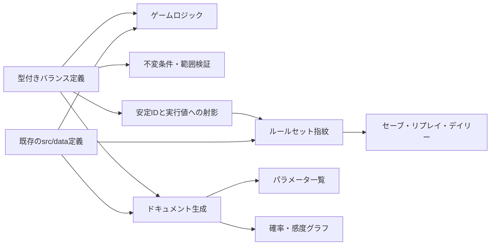

# バランスパラメータSSoT導入計画

ゲームバランスの調整値を、ゲーム実装とドキュメントの双方が参照できるSingle Source of Truth（SSoT）へ段階的に移行するための確定設計をまとめる。

本書はRI-105で対象境界と互換方針を確定した実装契約である。型付きレジストリ、生成パラメータ表、工程モデル、メンバー・採用、介入・差配、ラン進行・経済、KPI・勝敗・診断は移行済み（RI-106〜112）。残る領域は[`src/sim/`](../src/sim/)および[`src/data/`](../src/data/)の直書き値と照合して移す。実装の親エピックと1PR単位のバックログは[RI-104](./remaining-issues.md#ri-104-バランスパラメータssotの導入)で追跡する。

## 1. 目的

- 調整対象の値を一度変更すれば、ゲーム、パラメータ表、グラフへ同じ値が反映されるようにする。
- 値の意味、単位、許容範囲、影響領域をコードレビューで確認できるようにする。
- 確率、倍率、重み、tickなどの単位違いや、基本値と派生値の二重管理を防ぐ。
- 固定seedの再現性を、使用したバランスルールセットと結び付けて説明できるようにする。
- 調整前後の差分と統計的な影響を、機械的に検証できる土台を作る。

外部サービスから設定を取得する仕組みや、本番ゲーム内で値を書き換える管理画面は対象外とする。ローカル完結、静的バンドル、型安全という現在の特性を維持する。

## 2. SSoTに含めるもの

数値リテラルを無差別に一箇所へ移動すると、ドメインの文脈が失われ、変更競合も増える。RI-105では次の分類を境界として確定した。

| 分類 | 例 | SSoTでの扱い |
| --- | --- | --- |
| 調整可能な基本値 | Incident基礎率、AI速度倍率、Review処理量、休職閾値 | 型付きバランス定義へ移す |
| 確率分布・重み | タスク種別比率、高価値率、イベント種別率、レアリティ重み | 型付きバランス定義または既存データ定義を正本にする |
| 既存コンテンツ正本 | カード、イベント、レリック、難易度、試練、アンロック | 既存の`src/data/`を正本として集約・出力し、値をレジストリへ複製しない |
| 派生値 | 壁時計時間、合成倍率、条件付き確率 | 基本値から計算し、個別の調整値として重複保持しない |
| 検証メタデータ | 目標プレイ時間帯、介入回数帯、許容範囲 | レジストリまたは検証プロファイルで共有するが、実行結果の指紋から除外する |
| プロトコル上の不変値 | セーブスキーマ、フェーズ一覧、識別子 | バランスSSoTへ入れない |
| 表示専用値 | 色、余白、アニメーション時間、描画上限 | ゲームバランスへ影響しない限り入れない |
| テスト専用値 | E2E用seed、フィクスチャ、許容誤差 | 本体とは分離し、必要なら検証プロファイルとして管理する |

式そのものは純粋なTypeScript関数として残す。文字列化した式や独自DSLを評価する仕組みは導入せず、式が参照する係数、上下限、重みをSSoT化する。

SSoTへの収録とルールセット指紋への収録は別に判断する。ゲームが実行時に参照する値と、抽選・評価へ影響する既存コンテンツは指紋対象とする。説明、タグ、許容範囲、体験目標帯などの検証専用情報は同じレジストリから生成・検証しても指紋には含めない。

### 2.1 AI依存度に関するモデル境界

SSoTは値の置き場所を統一する仕組みであり、モデルの意味を自動的に改善するものではない。現行のRework式では、組織のAI依存度を全タスクへ加算し、AI支援タスクには別の固定リスクを加えている。

この式は、次の意味を十分に分離していない。

- AI生成コードや工程上の負債が、コードベース全体へ残す共有リスク
- AIなしでは生産性や品質を維持できない依存状態
- 人間がAIなしで実装する能力
- AI出力を評価・修正する能力

値の移動だけを行うPRでは現行式を変えない。`manualCapability`を含む状態分離はSSoT移行エピックの対象外とし、移行完了後に[probability-model.md §4.5.1](./probability-model.md#451-ai依存度の意味と再設計課題)を入力とする[RI-134](./remaining-issues.md#ri-134-ai依存モデルの再設計)で扱う。

## 3. 対象棚卸し

最新の`main`にある調整値、式内係数、`clamp`境界、既存コンテンツ、直接参照を次の単位で移行する。各行は移行担当RIを持ち、担当のない値は後段の除外一覧へ分類する。

| 領域 | 現在の正本・直接参照 | SSoTでの扱い | 担当RI |
| --- | --- | --- | --- |
| 詳細工程と初期組織 | [`src/sim/model/process.ts`](../src/sim/model/process.ts)、[`src/sim/org.ts`](../src/sim/org.ts)、`src/sim/run/engine.ts`のIncident信頼反映 | Coding、Review、Rework、Incident、Security、炎上、コンボ、AI無効時初期依存度の基本値・係数・上下限を`balance/process.ts`へ移す | RI-108 |
| メンバーと採用 | [`src/sim/member/roster.ts`](../src/sim/member/roster.ts)、`src/sim/orgscale/teamState.ts`の人数推定、`src/sim/run/engine.ts`の再編離脱、`tests/playtest/harness.ts`の復職係数 | 能力、スタミナ、成長、休職・復職、採用費、人数上限、最低稼働人数を`balance/member.ts`へ移し、複製参照を統合する | RI-109 |
| 介入と差配 | [`src/data/actions.ts`](../src/data/actions.ts)、[`src/sim/actions.ts`](../src/sim/actions.ts)、[`src/sim/assignTask.ts`](../src/sim/assignTask.ts)、[`src/sim/orgStat.ts`](../src/sim/orgStat.ts) | コスト、クールダウン、ゲージ、効果、副作用、状況閾値、持続tick、差配境界、共通組織指標の`clamp`上下限を`balance/actions.ts`へ移す。ID・ラベル・説明は既存定義に残す | RI-110 |
| ラン進行と経済 | [`src/sim/run/constants.ts`](../src/sim/run/constants.ts)、`src/sim/run/effects.ts`、`src/sim/run/engine.ts`、`src/sim/run/events.ts`、`src/sim/run/sprintBaselineBuild.ts`の課金式、`scripts/playtest-report.mjs`の進化ポイント直接読取 | 四半期構成、イベント率、結果適用時の生存境界、休息、ショップ、進化報酬、インフラ費用を`balance/run.ts`へ移し、スクリプトを正規参照へ変える | RI-111 |
| KPI・勝敗・診断 | [`src/sim/run/quarterReview.ts`](../src/sim/run/quarterReview.ts)、[`src/sim/outcome.ts`](../src/sim/outcome.ts)、[`src/sim/diagnosis.ts`](../src/sim/diagnosis.ts)、`src/state/runPersistence.ts`の旧セーブKPI再判定、`src/render/loseNextActionView.ts`、`src/render/status.ts`、`tests/playtest/harness.ts` | 目標、評価、即時敗北、勝利種別、診断、再編回復値、永続化・表示・方針側の同値参照を`balance/run.ts`または`balance/outcome.ts`へ移す | RI-112 |
| 粗粒度チームと業界 | [`src/sim/orgscale/teamState.ts`](../src/sim/orgscale/teamState.ts)、[`src/sim/orgscale/aggregate.ts`](../src/sim/orgscale/aggregate.ts)、[`src/sim/orgscale/industry.ts`](../src/sim/orgscale/industry.ts) | 初期分布、出荷、行列、Incident、状態ドリフト、評価、競合生成、ランキング得点・リーグ境界を`balance/coarse-team.ts`へ移す | RI-113 |
| ペーシング | [`src/sim/run/sprintBaselineBuild.ts`](../src/sim/run/sprintBaselineBuild.ts)、[`src/sim/engine.ts`](../src/sim/engine.ts)、`src/sim/run/engine.ts`、[`src/ui/sprintTempo.ts`](../src/ui/sprintTempo.ts)、[`src/ui/useRun.ts`](../src/ui/useRun.ts)、[`scripts/playtest-report.mjs`](../scripts/playtest-report.mjs) | タスク床、tick境界、回復率、共通固定ステップ、`MS_PER_TICK_1X`、体験目標帯を`balance/pacing.ts`へ移し、正規表現読取を廃止する | RI-114 |
| 既存コンテンツカタログ | `src/data/cards.ts`、`events.ts`、`difficulties.ts`、`bosses.ts`、`relics.ts`、`traits.ts`、`evolution.ts`、`goalAdjustments.ts`、`levers.ts`、`members.ts`、`unlocks.ts`、`departments.ts`、`actions.ts`、`src/sim/scenarios.ts`、`src/state/meta.ts`の実績ID | 既存定義を正本のまま生成表と指紋へ集約する。部門ID・定義順・`teamCount`、アクションID・意味のある定義順は結果へ影響する実行値として含め、部門名・色やアクションの表示文言・アイコンは表示メタデータとして除外する。`ALL_ACTION_IDS`と`ActionId`を含む重複列挙、イベント発火分類などプレイテスト側の複製は正本から導出する | RI-115 |
| タスク分布とスプリント評価 | [`src/sim/sprint.ts`](../src/sim/sprint.ts)、`src/sim/run/engine.ts`の粗粒度補正 | 種別重み、高価値率、完了時変化、評価ペナルティ、評価・称号・診断境界を`balance/sprint.ts`へ移す | RI-120 |
| カード共通実行ルール | [`src/sim/cards.ts`](../src/sim/cards.ts)、`src/sim/run/engine.ts`のドラフト・引き直し・ショップ | 手札・候補数、強化倍率、集中力下限、優先重み、効果境界、再試行上限を`balance/cards.ts`へ移す。カード固有値は既存定義に残す | RI-122 |
| メタ進行とデイリー | [`src/state/meta.ts`](../src/state/meta.ts)、`src/data/unlocks.ts` | デイリー難易度・試練、優先カード上限、ラン報酬係数など共通ルールを`balance/meta.ts`へ移す。アンロック固有のID・費用・前提は既存コンテンツ正本として集約する | RI-124 |

### 3.1 除外一覧

| 分類 | 具体例 | 除外理由 |
| --- | --- | --- |
| 永続化・プロトコル | `RUN_SAVE_SCHEMA_VERSION`、`REPLAY_SCHEMA_VERSION`、`GAME_DB_VERSION`、`TUTORIAL_CONTENT_VERSION`、旧スキーマ・storage key、保存可能フェーズ、リプレイフレーム対象、フェーズ・診断などの型上の識別子 | データ形式や状態機械の契約であり、ゲームバランスの調整値ではない。スキーマ更新は各永続化PRで管理する |
| 表示・実行安全 | `FRAME_MS`、`MAX_TICKS_PER_FRAME`、タブ復帰時アキュムレータ上限、描画寸法、色、余白、アニメーション時間 | 描画負荷や入力不能時間から実行を守る値であり、同じ入力列に対するsim結果を定義しない |
| 計算・保存上限 | `SPRINT_EVENT_LIMIT`、`WHAT_IF_TRIALS`、`REPLAY_MAX_COUNT`などの暴走防止・計算量・保存件数の上限 | バランスを表す値ではなく、安全性・性能・保存容量の契約として所有元に残す |
| テスト・測定プロファイル | `src/sim/run/quarterReviewSeeds.ts`のE2E seed、fixture、許容誤差、`PT_SEEDS`、方針固有の採点値、統計サンプル数・合否率 | 本番ゲームが参照しない。ゲーム閾値の複製だけは対応RIで正本参照へ変え、それ以外は再現条件としてレポートへ記録する |
| 開発ツール・アセット | `scripts/gallery.mjs`のseed・port・viewport、`scripts/generate-audio-assets.mjs`の音声生成値、`src/data/assets.ts`、部門名・色、実績・勝利称号のラベルやヒント | ゲーム結果のルールセットではなく、開発用出力または表示コンテンツである。部門ID・定義順・`teamCount`、実績IDと解除条件はコンテンツ／メタ進行側で扱う |
| 構造的リテラル | 配列index、ループ増分、百分率の`100`、単位変換の`1000`など | 式の構造・単位変換であり独立調整しない。挙動を調整する係数、分岐境界、`clamp`上下限はこの分類へ逃がさない |

移動だけのPRでは値、評価順、丸め位置、配列順、乱数消費順を変更しない。プレイテストの方針固有値はゲームルールと混ぜず、ルールセット版・指紋・seed集合・サンプル数とともに測定条件として記録する。

## 4. 確定アーキテクチャ

### 4.1 型付きの分割レジストリ

`src/data/balance/`を追加し、変更理由を一緒にレビューしやすい単位へ分割する。

```text
src/data/balance/
├── types.ts
├── define.ts
├── process.ts
├── sprint.ts
├── cards.ts
├── member.ts
├── actions.ts
├── run.ts
├── outcome.ts
├── meta.ts
├── coarse-team.ts
├── pacing.ts
└── index.ts
```

`balance/cards.ts`はカード共通実行ルールとして下図の型付きレジストリ経路へ入り、カードID・価格・効果値を持つ既存`src/data/cards.ts`はコンテンツ経路の正本として維持する。

各エントリーは少なくとも次の情報を持つ。

| 項目 | 用途 |
| --- | --- |
| `id` | ドキュメント、差分、ルールセット指紋で使う安定ID |
| `value` | ゲームが参照する値 |
| `label`、`description` | 人が意味と意図を確認するための説明 |
| `unit` | `probability`、`multiplier`、`ticks`、`points`など |
| `allowedRange` | 明らかな入力ミスを検出する範囲 |
| `tags` | AI、Review、Incidentなど影響領域の分類 |
| `derived` | 他の基本値から算出される値かどうか |

実装移行中は、既存のexport名をレジストリ値への別名として残す。UIやテストのimportを一度に書き換えず、小さいPRへ分割するためである。

### 4.2 データフロー



ゲームはビルド時にバンドルされた定義だけを読む。ネットワークや永続ストレージから値を上書きせず、オフライン動作と再現性を維持する。

### 4.3 ドキュメント生成

手書きの説明と機械生成する値を分離する。

```text
plan/probability-model.md
plan/generated/balance-parameters.md
plan/generated/content-catalog.md
plan/generated/balance-curves.svg
```

- `probability-model.md`: 因果、式の意味、設計判断、読み方を人が記述する。
- `balance-parameters.md`: ID、現在値、単位、範囲、説明をレジストリから生成する。
- `content-catalog.md`: 実行結果に影響するコンテンツ定義の射影を正本から生成する。
- `balance-curves.svg`: 同じ値と純粋な計算関数から代表曲線を生成する。

生成ファイルには直接編集しない旨を記載し、MarkdownとSVGをGit管理する。生成時刻、絶対パス、実行環境依存の順序など非決定的な情報は含めない。生成コマンドと差分チェックを`package.json`へ追加し、`balance:check`が生成後のGit差分を検出した場合はCIを失敗させる。

### 4.4 将来課題: AI依存モデルの再設計

この節はSSoT移行エピックの実装対象ではない。移行完了後に別課題としてAI依存モデルを変更する場合は、次の状態を独立して調整・検証できる形を候補とする。

| 状態 | 粒度 | 役割 |
| --- | --- | --- |
| `aiDependency` | 組織またはチーム | AIがないと通常の仕事を維持できない度合い |
| `manualCapability` | 初期はチーム、必要なら将来は個人 | AIなしで品質を保って実装する能力 |
| `aiLiteracy` / `aiMastery` | 組織 / 個人 | AIを安全に利用し、出力を検証する能力 |
| `quality` / `techDebt` | 組織またはチーム | AI支援の有無にかかわらず影響する共有リスク |

`manualCapability`を個人値にするには、タスクが担当者を保持するか、編成から代表値をどう選ぶかを決める必要がある。担当者を持たないまま個人値だけを追加すると、誰の能力をRework判定へ使ったか説明できないため、初期案はチーム集約値とする。

この変更では、低依存時はAI支援なしが安全でも、高依存・低手作業能力ではAI支援なしが危険になる交差を許容する。単調性テストを「AI依存度が上がると常に全タスクのRework率が上がる」という現在の条件から、状態別の条件へ更新する必要がある。

候補式の係数は、次の安定IDで独立して調整できるようにする。具体式と仮係数は[probability-model.md §4.5.2](./probability-model.md#452-rework候補式)を参照する。

| パラメータID | 役割 |
| --- | --- |
| `rework.shared.base` | Reworkの基礎率 |
| `rework.shared.qualityGapWeight` | 品質不足による共通リスク |
| `rework.shared.techDebtWeight` | 技術的負債による共通リスク |
| `rework.manual.skillGapWeight` | AI支援なしでの手作業能力不足 |
| `rework.manual.dependencyInteraction` | AI依存度と手作業能力不足の相互作用 |
| `rework.ai.skillGapWeight` | AI支援ありでのAI習熟不足 |
| `rework.ai.dependencyInteraction` | AI依存度とAI習熟不足の相互作用 |
| `rework.attemptDecay` | IncidentまたはRework経験後の減衰倍率 |
| `rework.minimum` / `rework.maximum` | 確率の下限と上限 |
| `state.aiDependency.gain` | AI支援タスクによる依存度増加 |
| `state.aiDependency.recovery` | AIなし実装や施策による依存度回復 |
| `state.manualCapability.decay` | AI支援中の手作業能力低下 |
| `state.manualCapability.practiceRecovery` | AIなし実装による手作業能力回復 |

能力合成の比率も調整対象にするが、個々の重みは合計1になる不変条件を持たせる。AI習熟を`aiRisk`と編成の`reworkRateAdd`へ重複反映しないことも検証する。

## 5. バージョンと再現性

SSoT化後の決定論は、次の条件で保証する。

```text
同じルールセット + 同じseed + 同じ開始状態 + 同じ入力列
  → 同じ結果
```

### 5.1 版と指紋

係数を変えれば、同じseedでも結果が変わる場合がある。この違いを不具合と仕様変更に切り分けるため、手動管理する`BALANCE_RULESET_VERSION`と、定義から算出する指紋を組で持つ。

`BALANCE_RULESET_VERSION`はRI-116で`1`から始める単調増加整数とし、次の規則で直前の版から1増やす。

- ゲームが参照する値、式、分岐、丸め位置、乱数消費順を変える。
- 結果へ影響するコンテンツのID、値、重み、抽選・評価に使う配列順を変える。
- 指紋の射影または算出方式を変える。

`label`、`description`、`unit`、`allowedRange`、`tags`、`derived`、体験目標帯などの検証メタデータ、表示専用値、テスト・測定条件、生成物の整形だけを変える場合は版を増やさない。コード変更で結果が変わるがレジストリ射影が変わらない場合も、手動版を増やすことでルールの差を識別する。

レジストリは安定IDとゲームが参照する実行値へ射影して指紋化する。`SIM_STEP_MS`／`FIXED_STEP_MS`、`MS_PER_TICK_1X`、タスクtick境界、回復率など実行時ペーシング値は含め、体験目標帯、`FRAME_MS`、`MAX_TICKS_PER_FRAME`は除外する。既存コンテンツについてもゲーム結果へ影響するID、値、重み、配列順を含める。意味のないオブジェクトキー順だけを正規化し、抽選・評価順に使う配列は定義順を保持する。

### 5.2 永続化と互換方針

| 保存対象 | 確定方針 |
| --- | --- |
| ラン途中セーブ | 保存時の版・指紋が現行と一致する場合だけ再開できる。不一致またはルールセット情報のない旧セーブは「不明な旧ルール／異なるルール」として再開不可にし、タイトルで理由と明示的な破棄導線を出す。検出時に自動削除せず、破棄操作までは要約を保持する |
| メタ進行 | 途中セーブの不一致によって無効化・初期化しない。完了済みデイリー記録、解放、実績、ポイントを保持する |
| リプレイ | 新規リプレイへ版・指紋と、表示に必要なカード・レリックなど参照コンテンツの最小スナップショットを記録する。リプレイUIはスナップショットを優先し、現行定義へ引き直さない。スナップショットのない旧リプレイは現行の互換ID定義へ解決し、見つからないIDも不明コンテンツのプレースホルダーとして状態から落とさない。「ルールセット不明」または記録時ルールを表示し、現行ルールでの再計算結果と同一視しない |
| デイリー | 識別子を「UTC日付、版、指紋」の組にする。seed、スコア、報酬受領状態をこの組ごとに分離し、同じUTC日付でもルールセットが異なれば各ルールセットで報酬を取得できる。旧日付キーの記録は不明ルールの記録として保持する |
| 不具合報告 | seed、版、指紋を組で取得し、コピー可能な診断情報にする |

途中セーブの構造破損や未対応スキーマはルールセット不一致と区別し、既存のスキーマ検証規則に従う。現在のラン保存スキーマは[`src/state/runPersistence.ts`](../src/state/runPersistence.ts)、リプレイスキーマは[`src/state/replay.ts`](../src/state/replay.ts)で管理されている。ルールセット情報を追加する段階では、保存スキーマ更新、旧データ補完、UI、互換テストを同じPRで扱う。

## 6. 検証とCI

### 6.1 定義の検証

- IDが一意で、変更時に不用意に再利用されていない。
- 値が有限で、単位ごとの許容範囲に入っている。
- 確率が`[0, 1]`に収まり、分布の重みが正である。
- 最小値が最大値を超えていない。
- 派生値が基本値と矛盾していない。
- 詳細モデルと粗粒度モデルで、主要な因果の向きが一致している。

### 6.2 生成物の検証

想定するコマンドは次のとおり。

```text
npm run balance:docs   # 表とグラフを生成
npm run balance:check  # 生成差分と定義の不変条件を検査
```

`balance:check`は通常CIへ追加し、定義違反または生成後にGit差分が残る場合は失敗させる。既存の`lint`、`format:check`、unit testも継続する。

### 6.3 バランス結果の検証

パラメータ一覧と、Monte Carloで観測した結果は別の成果物として扱う。

- パラメータ表は「設定した値」を示す。
- 固定seedの回帰テストは、因果の向きと大幅な崩壊を検知する。
- 多数seedのバランスレポートは、勝率、分位点、出荷、Incident、Reworkなど「結果分布」を示す。

これにより、設定値を変更していないのにロジック変更で分布が変わった場合も検出できる。

多数seedレポートは通常の`pull_request` CIでは実行しない。RI-119で`workflow_dispatch`と毎週月曜00:00 UTCの`main`定期実行を追加し、版、指紋、コホート、seed集合、サンプル数を含む結果を30日保持のGitHub Actions artifactとして保存する。レポート本体はGit管理せず、バランス調整PRでは必要に応じて手動実行結果をレビュー材料にする。

## 7. 段階的な導入計画

並行開発との競合と、移動に伴う意図しない挙動変更を避けるため、一括移行しない。

### Phase 0: 設計の合意（RI-105完了）

- 最新の`main`で対象値、直接参照、除外値を棚卸しした。
- SSoTへ含める値と含めない値の境界を確定した。
- 保存データ不一致時のUX、版の更新規則、生成物、多数seed実行方式を確定した。

完了条件: 充足済み。後続RIは本書の分類と互換方針を実装契約として使う。

### Phase 1: 基盤だけを導入

- RI-105の棚卸しを入力とし、基盤PRまでに追加された値だけを同じ分類へ追記する。
- 型、定義ヘルパー、IDと単位の検証を追加する。
- ドキュメント生成と`balance:check`を追加する。
- 代表値を少数だけ移し、生成経路を検証する。

完了条件: 充足済み（RI-106、RI-107）。ゲーム挙動を変えず、SSoTからゲームとパラメータ表を生成できる。代表曲線はRI-123で追加する。

### Phase 2: 詳細モデルを移行

- `process.ts`と`sprint.ts`の基本値、係数、上下限を移す。
- 既存exportは互換用の別名として維持する。
- 固定seed、単調性、統計レンジが移行前と一致することを確認する。

完了条件: 工程モデルとタスク分布は充足済み（RI-108、RI-120）。代表確率曲線（RI-123）は後続RIで扱う。移動だけでは結果を変えない。

### Phase 3: 周辺領域を移行

- メンバー・採用、介入・差配、ラン進行・経済、KPI・勝敗・診断条件は移行済み（RI-109〜RI-112）。残るペーシング、メタ進行・デイリー条件を領域ごとに移す。
- 既存の`src/data/`定義をパラメータ一覧へ集約する。
- 粗粒度モデルの係数を移し、詳細モデルとの方向性を検証する。
- RI-123で移行済みの値と純粋な計算関数から代表確率曲線を生成し、手書きグラフを置き換える。

完了条件: メンバー・採用、介入・差配、ラン進行・経済、KPI・勝敗・診断、カード実行ルールは充足済み（RI-109〜RI-112、RI-122）。残る粗粒度、ペーシング、コンテンツカタログ、メタ進行と代表曲線が未充足。調整対象として分類した値に安定ID、単位、説明が付き、代表確率曲線が同じ定義から生成されていること。

### Phase 4: ルールセットを永続化

- ルールセットバージョンと指紋を導入する。
- セーブ、リプレイ、デイリーseed、不具合情報へ記録する。
- 旧データの移行または非互換時の扱いを実装する。

完了条件: バランス変更前後の結果をルールセット単位で識別できる。

### 将来の別課題: AI依存モデルを再設計（RI-134）

- 共有リスク、AI依存、手作業能力、AI習熟の意味を分離する。
- `manualCapability`をチーム状態として持つか、既存値から導出するかを決める。
- 候補式の仮係数で、AI支援あり・なしの交差点と能力別の感度を可視化する。
- 共有、手作業、AI利用の各リスク項を個別にオン・オフして寄与を検証する。
- AI支援あり・なしの確率曲線と、プレイヤーへ提示する判断を合意する。
- 値移動とは別PRで式を変更し、ルールセットを更新する。
- 詳細モデル、粗粒度モデル、セーブ、リプレイ、診断表示を同時に確認する。

完了条件: AIを使う場合と使わない場合のリスクを、それぞれ独立した能力と組織状態から説明できる。

### Phase 5: 調整支援を拡張

- 多数seedのバランスレポートを生成する。
- パラメータ変更前後の差分と感度を可視化する。
- 必要性が確認できた場合のみ、開発用のバランス閲覧画面を追加する。

## 8. PR分割方針

| PR | 主な変更 | ゲーム挙動 |
| --- | --- | --- |
| 文書PR | 現状整理、設計判断、導入計画 | 変更なし |
| 基盤PR | 型、定義ヘルパー、生成・検証コマンド | 原則変更なし |
| 詳細モデルPR | `process`、`sprint`の値を移動 | 変更なし |
| 領域別PR | member、actions、run、coarse-teamなど | 変更なし |
| 調整PR | 値変更、生成文書、統計結果 | 意図した変更あり |
| 永続化PR | ルールセットとスキーマ | 互換性方針に従う |
| AI依存モデルPR | 手作業能力、AI習熟、共有リスクを分離 | 意図した変更あり |

値の「移動」と「調整」を同じPRに含めない。固定seedの差分が、構造変更によるものか調整によるものかを判別しやすくする。

## 9. リスクと対策

| リスク | 対策 |
| --- | --- |
| 巨大な設定ファイルになり競合する | ドメイン単位で分割し、集約は`index.ts`で行う |
| 数式内の係数を見落とす | `rg`とレビューで棚卸しし、対象外の数値は分類理由を残す |
| 値の移動で固定seed結果が変わる | 乱数呼び出しと評価順を維持し、移行前後を同一seedで比較する |
| 文書と実装が再びずれる | 生成物の差分をCIで検査する |
| 一つの値が多数のKPIを同時に変える | タグ、感度グラフ、同一seedペア、多数seedレポートを併用する |
| AI依存度が複数の意味を持ち、曲線を説明できない | 共有リスク、手作業能力、AI習熟を別状態・別項として扱う |
| 単位を取り違える | unitを必須にし、確率、百分率、倍率、tick、msを区別する |
| 保存中のランだけ挙動が変わる | ルールセットを保存し、不一致時の扱いを明示する |
| メタデータが本番バンドルを増やす | 初期は許容し、問題が確認された場合だけ実行値の生成物を分離する |

## 10. RI-105で確定した判断

| 判断事項 | 結論 |
| --- | --- |
| 途中セーブ不一致 | 再開不可。理由と破棄導線を表示し、自動削除しない |
| ルールセット版 | `1`始まりの単調増加整数。結果へ影響する変更で1増やす |
| ペーシング | 実行値と体験目標帯をSSoTへ含め、実行値だけを指紋化する |
| 生成Markdown・SVG | 決定論的に生成してGit管理し、通常CIで差分検査する |
| 多数seedレポート | 手動＋週次main。通常PR CI外、artifact 30日保持 |
| 旧リプレイ・デイリー | リプレイはルール不明表示で保持。デイリー記録・報酬は日付＋ルールセット単位で保持する |
| `manualCapability` | SSoT移行外の[RI-134](./remaining-issues.md#ri-134-ai依存モデルの再設計)へ延期する |
