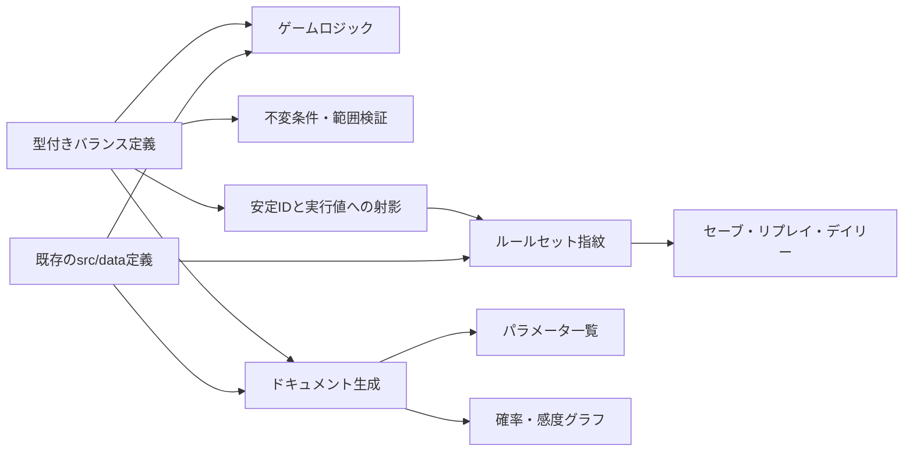

# バランスパラメータSSoT導入計画

ゲームバランスの調整値を、ゲーム実装とドキュメントの双方が参照できるSingle Source of Truth（SSoT）へ段階的に移行するための設計案をまとめる。

本書は実装前の計画である。現時点では[`probability-model.md`](./probability-model.md)に記載した値と、`src/sim/`および`src/data/`の実装を照合して調整する。実装の親エピックと1PR単位のバックログは[RI-104](./remaining-issues.md#ri-104-バランスパラメータssotの導入)で追跡し、最新の`main`を再調査してから着手する。

## 1. 目的

- 調整対象の値を一度変更すれば、ゲーム、パラメータ表、グラフへ同じ値が反映されるようにする。
- 値の意味、単位、許容範囲、影響領域をコードレビューで確認できるようにする。
- 確率、倍率、重み、tickなどの単位違いや、基本値と派生値の二重管理を防ぐ。
- 固定seedの再現性を、使用したバランスルールセットと結び付けて説明できるようにする。
- 調整前後の差分と統計的な影響を、機械的に検証できる土台を作る。

外部サービスから設定を取得する仕組みや、本番ゲーム内で値を書き換える管理画面は対象外とする。ローカル完結、静的バンドル、型安全という現在の特性を維持する。

## 2. SSoTに含めるもの

数値リテラルを無差別に一箇所へ移動すると、ドメインの文脈が失われ、変更競合も増える。次の分類に従って対象を決める。

| 分類 | 例 | SSoTでの扱い |
| --- | --- | --- |
| 調整可能な基本値 | Incident基礎率、AI速度倍率、Review処理量、休職閾値 | 型付きバランス定義へ移す |
| 確率分布・重み | タスク種別比率、高価値率、イベント種別率、レアリティ重み | 型付きバランス定義または既存データ定義を正本にする |
| コンテンツ定義 | カード、イベント、レリック、難易度、試練 | 既存の`src/data/`を正本として集約・出力する |
| 派生値 | 壁時計時間、合成倍率、条件付き確率 | 基本値から計算し、個別の調整値として重複保持しない |
| プロトコル上の不変値 | セーブスキーマ、フェーズ一覧、識別子 | バランスSSoTへ入れない |
| 表示専用値 | 色、余白、アニメーション時間、描画上限 | ゲームバランスへ影響しない限り入れない |
| テスト専用値 | E2E用seed、フィクスチャ、許容誤差 | 本体とは分離し、必要なら検証プロファイルとして管理する |

式そのものは純粋なTypeScript関数として残す。文字列化した式や独自DSLを評価する仕組みは導入せず、式が参照する係数、上下限、重みをSSoT化する。

### 2.1 AI依存度に関するモデル境界

SSoTは値の置き場所を統一する仕組みであり、モデルの意味を自動的に改善するものではない。現行のRework式では、組織のAI依存度を全タスクへ加算し、AI支援タスクには別の固定リスクを加えている。

この式は、次の意味を十分に分離していない。

- AI生成コードや工程上の負債が、コードベース全体へ残す共有リスク
- AIなしでは生産性や品質を維持できない依存状態
- 人間がAIなしで実装する能力
- AI出力を評価・修正する能力

値の移動だけを行うPRでは現行式を変えない。SSoT移行後のモデル変更として、[probability-model.md §4.5.1](./probability-model.md#451-ai依存度の意味と再設計課題)に示す状態分離を検討する。

## 3. 現在の配置

既存のコンテンツ定義は、すでにドメイン単位の正本として利用できる。

| 領域 | 現在の主な配置 |
| --- | --- |
| カードとレアリティ | [`src/data/cards.ts`](../src/data/cards.ts) |
| イベントと重み | [`src/data/events.ts`](../src/data/events.ts) |
| 難易度と試練 | [`src/data/difficulties.ts`](../src/data/difficulties.ts) |
| ボス、レリック、特性、進化 | `src/data/bosses.ts`、`src/data/relics.ts`、`src/data/traits.ts`、`src/data/evolution.ts` |
| 目標修正、レバー、メンバー、開始シナリオ | `src/data/goalAdjustments.ts`、`src/data/levers.ts`、`src/data/members.ts`、`src/sim/scenarios.ts` |

一方、数式の係数と閾値は用途別の実装へ分散している。

| 領域 | 現在の主な配置 | 主な調整対象 |
| --- | --- | --- |
| 詳細モデルと初期組織状態 | [`src/sim/model/process.ts`](../src/sim/model/process.ts)、[`src/sim/org.ts`](../src/sim/org.ts)、[`src/sim/run/engine.ts`](../src/sim/run/engine.ts)のIncident信頼反映 | Coding、Review、Incident、Rework、炎上、コンボ、AI無効時の初期依存度 |
| タスク生成 | [`src/sim/sprint.ts`](../src/sim/sprint.ts)、[`src/sim/run/engine.ts`](../src/sim/run/engine.ts)の粗粒度補正 | タスク種別重み、高価値率、粗粒度側の定型タスク比 |
| カード実行ルール | [`src/sim/cards.ts`](../src/sim/cards.ts)、[`src/sim/run/engine.ts`](../src/sim/run/engine.ts)のドラフト呼び出し | 手札枚数、強化倍率、集中力下限、候補数、優先ドラフト重み、効果境界 |
| メンバー | [`src/sim/member/roster.ts`](../src/sim/member/roster.ts)、[`src/sim/orgscale/teamState.ts`](../src/sim/orgscale/teamState.ts)のロスター生成、[`src/sim/run/engine.ts`](../src/sim/run/engine.ts)の再編離脱、[`tests/playtest/harness.ts`](../tests/playtest/harness.ts) | 能力倍率、スタミナ、休職・復職、採用、共有人数上限、最低稼働人数、プレイテスト方針 |
| 介入 | [`src/data/actions.ts`](../src/data/actions.ts)、[`src/sim/actions.ts`](../src/sim/actions.ts)、[`src/sim/assignTask.ts`](../src/sim/assignTask.ts) | 集中力コスト、クールダウン、ゲージ量、効果量、副作用、持続tick、差配進捗・士気・偏重上限 |
| ラン進行 | [`src/sim/run/engine.ts`](../src/sim/run/engine.ts)、[`src/sim/run/events.ts`](../src/sim/run/events.ts)、[`src/sim/run/sprintBaselineBuild.ts`](../src/sim/run/sprintBaselineBuild.ts)のインフラ課金 | スプリント数、イベント率、結果適用時の生存境界、休息、ショップ、インフラ費用・最低課金額 |
| KPI・勝敗・診断 | [`src/sim/run/quarterReview.ts`](../src/sim/run/quarterReview.ts)、[`src/sim/outcome.ts`](../src/sim/outcome.ts)、[`src/sim/diagnosis.ts`](../src/sim/diagnosis.ts)、`src/render/`の結果説明・HUD、[`tests/playtest/harness.ts`](../tests/playtest/harness.ts) | 目標、評価閾値、即時敗北条件、勝利種別へ影響する診断閾値、表示・方針側の同値参照 |
| 粗粒度モデル | [`src/sim/orgscale/teamState.ts`](../src/sim/orgscale/teamState.ts)、[`src/sim/orgscale/aggregate.ts`](../src/sim/orgscale/aggregate.ts)、[`src/sim/orgscale/industry.ts`](../src/sim/orgscale/industry.ts) | 出荷、行列、Incident、状態ドリフト、チーム・部門・全社評価、業界順位 |
| ペーシング | [`src/sim/run/sprintBaselineBuild.ts`](../src/sim/run/sprintBaselineBuild.ts)、[`src/sim/run/engine.ts`](../src/sim/run/engine.ts)、[`src/ui/sprintTempo.ts`](../src/ui/sprintTempo.ts)、[`src/ui/useRun.ts`](../src/ui/useRun.ts)、[`scripts/playtest-report.mjs`](../scripts/playtest-report.mjs) | タスク床、tick境界、スプリント間回復率、UI・sim共通固定ステップ、tick換算、目標プレイ時間、レポート入力 |
| メタ進行とデイリー | [`src/state/meta.ts`](../src/state/meta.ts) | デイリー難易度・試練、優先カード上限、ラン報酬係数 |

SSoT導入時には、export済み定数だけでなく、数式内の係数と`clamp`境界も棚卸しする。移動だけのPRでは値と乱数消費順を変更しない。

## 4. 推奨アーキテクチャ

### 4.1 型付きの分割レジストリ

`src/data/balance/`を追加し、変更理由を一緒にレビューしやすい単位へ分割する。

```text
src/data/balance/
├── types.ts
├── define.ts
├── process.ts
├── sprint.ts
├── cards.ts
├── member.ts
├── actions.ts
├── run.ts
├── outcome.ts
├── meta.ts
├── coarse-team.ts
├── pacing.ts
└── index.ts
```

`balance/cards.ts`はカード共通実行ルールとして下図の型付きレジストリ経路へ入り、カードID・価格・効果値を持つ既存`src/data/cards.ts`はコンテンツ経路の正本として維持する。

各エントリーは少なくとも次の情報を持つ。

| 項目 | 用途 |
| --- | --- |
| `id` | ドキュメント、差分、ルールセット指紋で使う安定ID |
| `value` | ゲームが参照する値 |
| `label`、`description` | 人が意味と意図を確認するための説明 |
| `unit` | `probability`、`multiplier`、`ticks`、`points`など |
| `allowedRange` | 明らかな入力ミスを検出する範囲 |
| `tags` | AI、Review、Incidentなど影響領域の分類 |
| `derived` | 他の基本値から算出される値かどうか |

実装移行中は、既存のexport名をレジストリ値への別名として残す。UIやテストのimportを一度に書き換えず、小さいPRへ分割するためである。

### 4.2 データフロー



ゲームはビルド時にバンドルされた定義だけを読む。ネットワークや永続ストレージから値を上書きせず、オフライン動作と再現性を維持する。

### 4.3 ドキュメント生成

手書きの説明と機械生成する値を分離する。

```text
plan/probability-model.md
plan/generated/balance-parameters.md
plan/generated/balance-curves.svg
```

- `probability-model.md`: 因果、式の意味、設計判断、読み方を人が記述する。
- `balance-parameters.md`: ID、現在値、単位、範囲、説明をレジストリから生成する。
- `balance-curves.svg`: 同じ値と純粋な計算関数から代表曲線を生成する。

生成ファイルには直接編集しない旨を記載する。生成コマンドと差分チェックを`package.json`へ追加し、文書の更新漏れをCIで検出する。TypeScriptの定義をNodeから読み込む方法として、実装時に`tsx`などの開発時ランナーを追加する案を第一候補とする。

### 4.4 AI依存モデルを再設計する場合

SSoT移行後にAI依存モデルを変更する場合は、次の状態を独立して調整・検証できる形を推奨する。

| 状態 | 粒度 | 役割 |
| --- | --- | --- |
| `aiDependency` | 組織またはチーム | AIがないと通常の仕事を維持できない度合い |
| `manualCapability` | 初期はチーム、必要なら将来は個人 | AIなしで品質を保って実装する能力 |
| `aiLiteracy` / `aiMastery` | 組織 / 個人 | AIを安全に利用し、出力を検証する能力 |
| `quality` / `techDebt` | 組織またはチーム | AI支援の有無にかかわらず影響する共有リスク |

`manualCapability`を個人値にするには、タスクが担当者を保持するか、編成から代表値をどう選ぶかを決める必要がある。担当者を持たないまま個人値だけを追加すると、誰の能力をRework判定へ使ったか説明できないため、初期案はチーム集約値とする。

この変更では、低依存時はAI支援なしが安全でも、高依存・低手作業能力ではAI支援なしが危険になる交差を許容する。単調性テストを「AI依存度が上がると常に全タスクのRework率が上がる」という現在の条件から、状態別の条件へ更新する必要がある。

候補式の係数は、次の安定IDで独立して調整できるようにする。具体式と仮係数は[probability-model.md §4.5.2](./probability-model.md#452-rework候補式)を参照する。

| パラメータID | 役割 |
| --- | --- |
| `rework.shared.base` | Reworkの基礎率 |
| `rework.shared.qualityGapWeight` | 品質不足による共通リスク |
| `rework.shared.techDebtWeight` | 技術的負債による共通リスク |
| `rework.manual.skillGapWeight` | AI支援なしでの手作業能力不足 |
| `rework.manual.dependencyInteraction` | AI依存度と手作業能力不足の相互作用 |
| `rework.ai.skillGapWeight` | AI支援ありでのAI習熟不足 |
| `rework.ai.dependencyInteraction` | AI依存度とAI習熟不足の相互作用 |
| `rework.attemptDecay` | IncidentまたはRework経験後の減衰倍率 |
| `rework.minimum` / `rework.maximum` | 確率の下限と上限 |
| `state.aiDependency.gain` | AI支援タスクによる依存度増加 |
| `state.aiDependency.recovery` | AIなし実装や施策による依存度回復 |
| `state.manualCapability.decay` | AI支援中の手作業能力低下 |
| `state.manualCapability.practiceRecovery` | AIなし実装による手作業能力回復 |

能力合成の比率も調整対象にするが、個々の重みは合計1になる不変条件を持たせる。AI習熟を`aiRisk`と編成の`reworkRateAdd`へ重複反映しないことも検証する。

## 5. バージョンと再現性

SSoT化後の決定論は、次の条件で保証する。

```text
同じルールセット + 同じseed + 同じ開始状態 + 同じ入力列
  → 同じ結果
```

係数を変えれば、同じseedでも結果が変わる場合がある。この違いを不具合と仕様変更に切り分けるため、手動管理する`BALANCE_RULESET_VERSION`と、定義から算出する指紋を持つ。レジストリは安定IDとゲームが参照する実行値へ射影して指紋化し、`label`、`description`、`unit`、`allowedRange`、`tags`、`derived`など表示・検証専用メタデータは入力から除外する。指紋の入力には新しいバランスレジストリだけでなく、カード、イベント、レリック、難易度、目標修正、レバー、メンバー、開始シナリオなど既存定義のうち、ゲーム結果へ影響するID、値、重み、配列順も含める。オブジェクトキーなどゲーム上の意味を持たない順序だけを安定化し、抽選・評価順に使う配列は定義順を保って算出することで、コンテンツと順序の変更をルールセットの違いとして自動検出できるようにする。

| 保存対象 | 推奨方針 |
| --- | --- |
| ラン途中セーブ | 保存時のルールセットを記録し、不一致時の継続可否を明示する |
| リプレイ | 記録時のルールセットを表示し、現行ルールでの再計算と区別する |
| デイリーseed | 日付だけでなくルールセットを識別子へ含める |
| 不具合報告 | seedとルールセット指紋をセットで取得する |

現在のラン保存スキーマは[`src/state/runPersistence.ts`](../src/state/runPersistence.ts)、リプレイスキーマは[`src/state/replay.ts`](../src/state/replay.ts)で管理されている。ルールセット情報を追加する段階では、既存保存データの読み込み方針とスキーマ更新を同じPRで扱う。

## 6. 検証とCI

### 6.1 定義の検証

- IDが一意で、変更時に不用意に再利用されていない。
- 値が有限で、単位ごとの許容範囲に入っている。
- 確率が`[0, 1]`に収まり、分布の重みが正である。
- 最小値が最大値を超えていない。
- 派生値が基本値と矛盾していない。
- 詳細モデルと粗粒度モデルで、主要な因果の向きが一致している。

### 6.2 生成物の検証

想定するコマンドは次のとおり。

```text
npm run balance:docs   # 表とグラフを生成
npm run balance:check  # 生成差分と定義の不変条件を検査
```

`balance:check`はCIへ追加し、生成後にGit差分が残る場合は失敗させる。既存の`lint`、`format:check`、unit testも継続する。

### 6.3 バランス結果の検証

パラメータ一覧と、Monte Carloで観測した結果は別の成果物として扱う。

- パラメータ表は「設定した値」を示す。
- 固定seedの回帰テストは、因果の向きと大幅な崩壊を検知する。
- 多数seedのバランスレポートは、勝率、分位点、出荷、Incident、Reworkなど「結果分布」を示す。

これにより、設定値を変更していないのにロジック変更で分布が変わった場合も検出できる。

## 7. 段階的な導入計画

並行開発との競合と、移動に伴う意図しない挙動変更を避けるため、一括移行しない。

### Phase 0: 設計の合意

- 本計画と確率モデル文書をレビューする。
- SSoTへ含める値と含めない値の境界を合意する。
- 保存データ不一致時のUXと、ルールセットの更新規則を決める。

完了条件: 実装前の判断事項が文書化され、並行中の大規模実装が`main`へ統合されている。

### Phase 1: 基盤だけを導入

- 最新の`main`で`src/sim/`、`src/data/`、`src/state/meta.ts`、ペーシング、補助スクリプトのパラメータ配置を再度棚卸しする。
- 型、定義ヘルパー、IDと単位の検証を追加する。
- ドキュメント生成と`balance:check`を追加する。
- 代表値を少数だけ移し、生成経路を検証する。

完了条件: ゲーム挙動を変えず、SSoTからゲームと文書の双方を生成できる。

### Phase 2: 詳細モデルを移行

- `process.ts`と`sprint.ts`の基本値、係数、上下限を移す。
- 既存exportは互換用の別名として維持する。
- 固定seed、単調性、統計レンジが移行前と一致することを確認する。

完了条件: 詳細スプリントの代表式をSSoTから調整でき、移動だけでは結果が変わらない。代表確率曲線の置換はRI-123で行い、本フェーズの移行PRには含めない。

### Phase 3: 周辺領域を移行

- メンバー、介入、ラン進行、KPI、勝敗・診断条件、ペーシング、メタ進行・デイリー条件を領域ごとに移す。
- 既存の`src/data/`定義をパラメータ一覧へ集約する。
- 粗粒度モデルの係数を移し、詳細モデルとの方向性を検証する。
- RI-123で移行済みの値と純粋な計算関数から代表確率曲線を生成し、手書きグラフを置き換える。

完了条件: 調整対象として分類した値に安定ID、単位、説明が付き、代表確率曲線が同じ定義から生成されている。

### Phase 4: ルールセットを永続化

- ルールセットバージョンと指紋を導入する。
- セーブ、リプレイ、デイリーseed、不具合情報へ記録する。
- 旧データの移行または非互換時の扱いを実装する。

完了条件: バランス変更前後の結果をルールセット単位で識別できる。

### Phase 5: AI依存モデルを再設計

- 共有リスク、AI依存、手作業能力、AI習熟の意味を分離する。
- `manualCapability`をチーム状態として持つか、既存値から導出するかを決める。
- 候補式の仮係数で、AI支援あり・なしの交差点と能力別の感度を可視化する。
- 共有、手作業、AI利用の各リスク項を個別にオン・オフして寄与を検証する。
- AI支援あり・なしの確率曲線と、プレイヤーへ提示する判断を合意する。
- 値移動とは別PRで式を変更し、ルールセットを更新する。
- 詳細モデル、粗粒度モデル、セーブ、リプレイ、診断表示を同時に確認する。

完了条件: AIを使う場合と使わない場合のリスクを、それぞれ独立した能力と組織状態から説明できる。

### Phase 6: 調整支援を拡張

- 多数seedのバランスレポートを生成する。
- パラメータ変更前後の差分と感度を可視化する。
- 必要性が確認できた場合のみ、開発用のバランス閲覧画面を追加する。

## 8. PR分割方針

| PR | 主な変更 | ゲーム挙動 |
| --- | --- | --- |
| 文書PR | 現状整理、設計判断、導入計画 | 変更なし |
| 基盤PR | 型、定義ヘルパー、生成・検証コマンド | 原則変更なし |
| 詳細モデルPR | `process`、`sprint`の値を移動 | 変更なし |
| 領域別PR | member、actions、run、coarse-teamなど | 変更なし |
| 調整PR | 値変更、生成文書、統計結果 | 意図した変更あり |
| 永続化PR | ルールセットとスキーマ | 互換性方針に従う |
| AI依存モデルPR | 手作業能力、AI習熟、共有リスクを分離 | 意図した変更あり |

値の「移動」と「調整」を同じPRに含めない。固定seedの差分が、構造変更によるものか調整によるものかを判別しやすくする。

## 9. リスクと対策

| リスク | 対策 |
| --- | --- |
| 巨大な設定ファイルになり競合する | ドメイン単位で分割し、集約は`index.ts`で行う |
| 数式内の係数を見落とす | `rg`とレビューで棚卸しし、対象外の数値は分類理由を残す |
| 値の移動で固定seed結果が変わる | 乱数呼び出しと評価順を維持し、移行前後を同一seedで比較する |
| 文書と実装が再びずれる | 生成物の差分をCIで検査する |
| 一つの値が多数のKPIを同時に変える | タグ、感度グラフ、同一seedペア、多数seedレポートを併用する |
| AI依存度が複数の意味を持ち、曲線を説明できない | 共有リスク、手作業能力、AI習熟を別状態・別項として扱う |
| 単位を取り違える | unitを必須にし、確率、百分率、倍率、tick、msを区別する |
| 保存中のランだけ挙動が変わる | ルールセットを保存し、不一致時の扱いを明示する |
| メタデータが本番バンドルを増やす | 初期は許容し、問題が確認された場合だけ実行値の生成物を分離する |

## 10. 実装着手前の確認事項

1. 並行中の大規模実装が統合され、対象ファイルの構造が確定しているか。
2. バランス変更後の既存ラン保存を、継続、警告付き継続、無効化のどれにするか。
3. ルールセットバージョンをいつ更新するか。
4. ペーシング値をゲームバランスに含めるか、表示・操作設定として分離するか。
5. 生成されたMarkdownとSVGをGit管理するか。
6. 多数seedレポートをCIで毎回生成するか、手動・定期実行にするか。
7. `manualCapability`をチーム状態として持つか、個人状態まで拡張するか。
