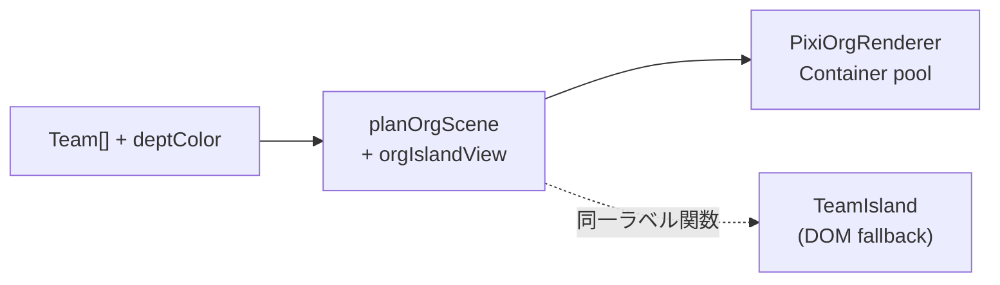

# フェーズ6b: Pixi 全社マップ — 見た目 parity と Phase 6 DoD 完遂

Phase 6a（React 接続・pan/zoom・カリング）完了後の続き。出典は [`phase-6-webgl-migration.md`](./phase-6-webgl-migration.md) §3〜§5、[follow-ups.md](./follow-ups.md) フェーズ5、[SPEC.md](../SPEC.md) 第22.4 / 第22.5。

> 前提（変更なし）: 実 WebGL は **CI/Node で回さない**。Vitest は純 TS（シーン計画・LOD・ラベル）のみ。ピクセル検証・FPS 計測はホストブラウザ（DevContainer 5173 フォワード）。

---

## 1. 現状（Phase 6a–6d 完了 / 6e 任意）

| 項目 | 状態 |
| --- | --- |
| `?renderer=pixi` opt-in | ✅ `OrgScreen` → `OrgPixiField` → `PixiOrgRenderer` |
| pan / zoom / カリング | ✅ pixi-viewport + `getCameraRect()` + `planOrgScene` |
| 座標系 | ✅ `isoLayoutOrigin` で DOM `layoutIso` と一致 |
| チーム島の見た目 | ✅ Container( 菱形 + カード/バッジ/ドット LOD )。DOM 同等の情報量（6b 完了） |
| `focusDept` / `zoomTo` と viewport 同期 | ✅ 部門チップ / パンくず / 島クリックと viewport を同期（6c 完了） |
| 性能予算 DoD（§4 数値固定） | ✅ 定数確定・Vitest 大規模 fixture・代表 seed ブラウザ計測（6d 完了）。メモリリークは手動 DevTools 確認推奨 |
| 視覚回帰 | ✅ opt-in E2E（`npm run test:e2e:pixi` / `@pixi` tag。CI 既定 job 外） |

**ギャップ（DOM `TeamIsland` にあって Pixi にないもの）** — 6b-2 で解消済み（✅）

- ✅ 部門色の枠線
- ✅ チーム名（プレイヤー ★）
- ✅ 出荷 / AI 依存度
- ✅ 炎上件数（🔥N）
- ✅ 健全度バッジ・カード型レイアウト（116px 幅）
- ✅ ホバー強調

---

## 2. 方針

1. **状態→見た目は純 TS で先に固める**（第22.5）。DOM と Pixi が同じ `planOrgScene` / ラベル関数を読む。
2. **LOD（詳細度）を zoom に連動**させ、数百〜数千チームでもテキスト描画コストを抑える。
3. **1 チーム = 1 Container**（菱形 + ラベル群）。プール対象を `Graphics` から `Container` に昇格。
4. DOM フォールバックと CI E2E は維持。Pixi 専用 E2E / 視覚回帰は opt-in のみ。



---

## 3. サブフェーズと着手順

### 6b-1: 純 TS — 島の見た目計画を拡張（GPU 不要）

**目的:** DOM と Pixi が同じ「何を表示するか」を共有する。

| 作業 | ファイル |
| --- | --- |
| `OrgSprite` に表示フィールド追加 | [`src/render/orgScene.ts`](../src/render/orgScene.ts) |
| ラベル・truncation・LOD 判定を純関数化 | 新規 [`src/render/orgIslandView.ts`](../src/render/orgIslandView.ts) |
| 部門色 lookup | `planOrgScene` の opts に `deptColor: (id) => string` または `departments` 配列 |
| Vitest 追加 | [`tests/unit/orgScene.test.ts`](../tests/unit/orgScene.test.ts), 新規 `orgIslandView.test.ts` |

**`OrgSprite` 追加フィールド（案）**

```typescript
interface OrgSprite {
  // 既存: teamId, x, y, tint, isPlayer, fire
  name: string;
  deptColor: string;
  shipping: number;
  aiDependency: number;
  incidents: number;
  health: TeamHealth;
  /** LOD: 'dot' | 'badge' | 'card' */
  detail: OrgIslandDetail;
}
```

**LOD 閾値（案・Vitest で固定）**

| viewport scale | detail | 表示内容 |
| --- | --- | --- |
| `< 0.35` | `dot` | 菱形のみ |
| `0.35 .. 0.7` | `badge` | 菱形 + 短い名前 + 炎上ドット |
| `>= 0.7` | `card` | DOM 同等（名前・出荷・AI・🔥・部門枠） |

`planOrgScene` に `zoomScale: number` を opts で渡す。scale は Pixi 側 `viewport.scale.x` から供給。

**DoD** — ✅ 完了（`src/render/orgIslandView.ts` / `orgScene.ts` 拡張、`tests/unit/orgIslandView.test.ts` / `orgScene.test.ts` 緑）

- [x] 同一 Team 入力で DOM 相当のラベル文字列が純関数で決定論的に導出される
- [x] LOD 境界値の Vitest が緑
- [x] 既存 `orgScene.test.ts` が拡張フィールド込みで緑

---

### 6b-2: Pixi — 複合スプライト描画（ブラウザのみ）

**目的:** 情報量を DOM に近づける。

| 作業 | ファイル |
| --- | --- |
| `SpritePool<Container>` へ変更 | [`src/render/adapters/pixiOrgRenderer.ts`](../src/render/adapters/pixiOrgRenderer.ts) |
| 島 1 個 = Container( Graphics 菱形 + Text 群 ) | 同上 |
| `detail` に応じて Text の表示/非表示 | 同上 |
| 部門色 stroke・プレイヤー gold outline | 同上 |
| 炎上: stroke 点滅（`app.ticker`、browser のみ） | 同上 |
| `OrgPixiField` から `zoomScale` を render 時に渡す | [`src/ui/OrgPixiField.tsx`](../src/ui/OrgPixiField.tsx) |

**描画メモ**

- 初版は Pixi `Text`（v8）で十分。60fps を下回る場合のみ `BitmapText` + 共有フォント atlas へ差し替え（6d で判断）。
- 長いチーム名は `orgIslandView.truncateName(name, maxWidth)` で省略。
- ヒット領域は Container 全体（card サイズに拡張）。

**DoD** — ✅ 完了（`PixiOrgRenderer` を `SpritePool<Container>` 化し、card/badge/dot の LOD・部門色 stroke・★ gold outline・炎上 stroke 点滅を実装）

- [x] `/?renderer=pixi&seed=zoom-e2e` で全社マップを開き、**ズームイン時に DOM と同等の情報**（名前・出荷・AI・炎上・部門枠・★）が読める
- [x] ズームアウト時に LOD でラベルが間引かれ、フレーム落ちしない
- [x] 島クリックで `onFocusTeam` が動く（既存挙動維持）

---

### 6c: カメラ — 4 階層ズームと viewport 同期

**目的:** 部門チップ / パンくず / ドリルダウンと Pixi カメラを連動。

| 作業 | 内容 |
| --- | --- |
| `OrgPixiField` に `zoom: ZoomState` と `departments` を props 追加 | [`src/ui/OrgScreen.tsx`](../src/ui/OrgScreen.tsx) から渡す |
| `PixiOrgRenderer.focusTeam(id)` | 該当島へ `animate({ position, scale })` |
| `PixiOrgRenderer.focusDept(id)` | 部門チーム群の bounding box へ fit |
| `zoomTo('company')` 復帰 | `fitToContent` 相当へ animate |
| 部門チップクリック | 既存 `onFocusDept` + viewport アニメ |

**DoD** — ✅ 完了（`OrgPixiField` の `focusCompany` / `focusDepartment` / `focusTeamCamera` を `src/render/orgCamera.ts` の純TS bounds で実装し、`OrgScreen` の部門チップ / パンくず / 島クリックへ接続）

- [x] 部門チップ → 該当ゾーンへカメラが寄る
- [x] パンくず「全社」→ 全体 fit に戻る
- [x] プレイヤー島クリック → ドリルダウン（engine 側は既存のまま）

---

### 6d: 性能予算 DoD の確定（ローカル計測 → 数値テスト）

**目的:** [phase-6 §4](./phase-6-webgl-migration.md#4-性能予算-dodローカルで計測して埋める) を数値で固定。

**計測手順（ホストブラウザ）**

1. 代表 seed でラン開始 → 全社マップ（`?renderer=pixi`）
2. DevTools Performance: pan/zoom 中のフレーム時間
3. `planOrgScene` の `culled` / `overBudget` / `sprites.length` を console または dev-only HUD で表示
4. Memory: 全社 ↔ 部署 ↔ 全社 を 10 回繰り返し、WebGL コンテキストリークがないか確認

**確定後にコードへ反映**

| 定数 | ファイル | 確定値 |
| --- | --- | --- |
| `ORG_SPRITE_BUDGET` | [`src/render/orgView.ts`](../src/render/orgView.ts) | **500**（変更なし。通常ラン ~10 件で overBudget=0、1000 件 stress 全可視時は 500 件まで描画） |
| LOD 閾値 | [`src/render/orgIslandView.ts`](../src/render/orgIslandView.ts) | **dot < 0.35 / badge < 0.7 / card >= 0.7**（変更なし） |
| Vitest fixture | [`tests/fixtures/orgSceneTeams.ts`](../tests/fixtures/orgSceneTeams.ts) + [`tests/unit/orgScene.test.ts`](../tests/unit/orgScene.test.ts) | 100 / 500 / 1000 件。viewport カメラでは overBudget=0、全可視 stress では min(count, 500) |

**§4 性能指標（実測値と上限）**

| 指標 | 実測（代表） | 上限 | 取得元 |
| --- | --- | --- | --- |
| 同時スプライト数 | 通常 seed: **10** / stress 1000 全可視: **500** | `ORG_SPRITE_BUDGET` (=500) | `data-org-sprites` / `plan.sprites.length` |
| カリング数 | 通常 seed 全社 fit: **0** / stress 1000 viewport: **>0** | — | `data-org-culled` / `plan.culled` |
| 予算超過数 | 通常 seed: **0** / stress 1000 全可視: **500** | 0（通常プレイ）または stress 許容 | `data-org-over-budget` / `plan.overBudget` |
| フレーム時間 | idle ~**16ms**（~63fps、`seed=zoom-e2e` Chromium） | **< 16.7ms**（60fps） | Playwright rAF サンプル（pan/zoom 中は手動 Performance 推奨） |
| メモリ | 自動計測未実施 | 安定（リーク無し） | DevTools Memory（全社↔部署 10 回は手動確認推奨） |

**メトリクス確認（実装済み）**

- `OrgPixiField` の `[data-testid="org-pixi-mount"]` に `data-org-sprites` / `data-org-culled` / `data-org-over-budget` / `data-org-total` を毎フレーム反映。
- 大規模件数（100/500/1000）は Vitest fixture [`stressOrgTeams()`](../tests/fixtures/orgSceneTeams.ts) で GPU 無し検証。

**DoD** — ✅ 完了。

- [x] §4 表の各指標に**実測値と上限**が plan または定数コメントに記載されている
- [x] Vitest で `culled` / `overBudget` / プール上限が回帰検知できる
- [x] **CI では FPS を assert しない**（第22.5 準拠）

---

### 6e: 視覚回帰（任意・判断）

**判断基準:** 6b-2 で DOM parity が取れたら、固定 seed + `pause()` + `?renderer=pixi` の Playwright スクショ 1〜2 枚を追加するか検討。

- CI 既定は DOM のまま
- Pixi 視覚回帰は別 job または `@pixi` tag で opt-in
- フレーク対策: アニメ停止（`document.getAnimations()`）、viewport scale 固定

**DoD（採用する場合のみ）** — ✅ 完了（`tests/e2e/org-pixi-visual.spec.ts` / `npm run test:e2e:pixi`）

- [x] seed 固定でスクリーンショット diff が安定
- [x] CI デフォルト job は DOM E2E のみ緑

---

## 4. スコープ外（Phase 6 以降）

| 項目 | 理由 |
| --- | --- |
| スプリント盤面の Pixi 化 | 粒数数十。全社マップ DoD 完遂後 |
| 健全度別テクスチャ / パーティクル延焼 | 6b-2 の Graphics/Text で足りる間は後回し |
| `?renderer=pixi` を CI デフォルトにする | architecture §4.2 方針と矛盾 |
| Node headless-gl | 禁止（第22.5） |

---

## 5. 推奨 PR 分割

| PR | 内容 | レビューしやすさ |
| --- | --- | --- |
| **PR-A** | 6b-1 純 TS 拡張 + Vitest | GPU 不要・差分小 |
| **PR-B** | 6b-2 Pixi 複合描画 + LOD | 見た目確認が必要 |
| **PR-C** | 6c カメラ同期 | 操作感 |
| **PR-D** | 6d 性能定数 + 大規模 fixture テスト | 数値のみ |
| **PR-E**（任意） | 6e 視覚回帰 | 別 job |

---

## 6. Phase 6 全体 DoD（完遂チェックリスト）

[phase-6 §5](./phase-6-webgl-migration.md#5-完了の目安dod) を満たすための最終状態:

- [x] `?renderer=pixi` で全社マップが Pixi 描画（6a）
- [x] ドリルダウン / パン / ズーム（6a）
- [x] DOM と **同等の情報量**（6b）
- [x] `focusDept` / `zoomTo` と viewport 同期（6c）
- [x] 性能予算が数値で確定し Vitest 回帰あり（6d）
- [x] 既定 DOM + CI E2E 緑（6a 維持）

---

## 7. 残作業

6b-1 / 6b-2（PR-A / PR-B）、6c（PR-C）、6d（PR-D）、6e（PR-E・任意）まで実装済み（§3・§6 参照）。Phase 6 DoD は完遂。
